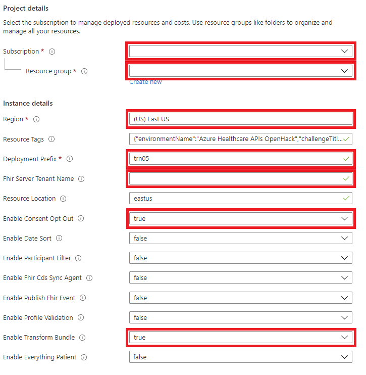

# Challenge-01 - Deploy Azure Health Data Services workspace and FHIR service

## Introduction

Welcome to Challenge-01!

In this challenge, you will deploy an **[Azure Health Data Services workspace](https://docs.microsoft.com/azure/healthcare-apis/workspace-overview)** containing a **[FHIR service](https://docs.microsoft.com/azure/healthcare-apis/fhir/overview)** instance. In addition, you will set up **[Postman](https://www.postman.com/)** as your application for testing the FHIR service API.

## Learning Objectives for Challenge-01

By the end of this challenge you will be able to

+ explain the difference between workspaces and services in Azure Health Data Services
+ use a template to deploy a FHIR service instance inside an Azure Health Data Services workspace
+ create an AAD service client for Postman and grant it access to your FHIR service
+ configure and use Postman for sending web API requests to your FHIR service

## Background

**FHIR service** is the core component for reading, writing, and querying structured health data in [Azure Health Data Services](https://docs.microsoft.com/azure/healthcare-apis/healthcare-apis-overview). You may have heard of the predecessor to FHIR service – called Azure API for FHIR (Microsoft's first generally available FHIR PaaS solution). For this training, we will be focusing on the new Azure Health Data Services FHIR service, which has some big advantages over its predecessor (like transaction bundles, workspace level configuration, and performance improvements for search, import, and export). 

### Azure Health Data Services workspace relationship with FHIR, DICOM, and MedTech services

In the Azure health ecosystem, the Azure Health Data Services workspace is a logical container for associated healthcare service instances such as [FHIR](https://docs.microsoft.com/azure/healthcare-apis/fhir/overview), [DICOM (Digital Imaging and Communications in Medicine)](https://docs.microsoft.com/en-us/azure/healthcare-apis/dicom/dicom-services-overview), and [MedTech](https://docs.microsoft.com/en-us/azure/healthcare-apis/iot/iot-connector-overview) services. You can provision multiple FHIR, DICOM, and MedTech services in a single workspace to meet your solution needs.


The workspace also creates a compliance boundary (HIPAA, HITRUST) within which protected health information can travel. This means that [Role-Based Access Control (RBAC)](https://docs.microsoft.com/azure/healthcare-apis/configure-azure-rbac), private network data transit with [Private Link](https://docs.microsoft.com/azure/healthcare-apis/healthcare-apis-configure-private-link), and [event messages](https://docs.microsoft.com/azure/healthcare-apis/events/events-deploy-portal) can all be configured at the workspace level – reducing your system management complexity.

## Prerequisites

+ Before deploying to your Azure environment, please make sure that you have the following permissions.

    + **Azure Subscription:** You must have rights to deploy resources at the resource group scope in your Azure subscription (i.e. [Owner](https://docs.microsoft.com/azure/role-based-access-control/built-in-roles#owner) role).

    + **Azure Active Directory (AAD):** For configuring app settings in Challenge-07, you must have [Application Administrator](https://docs.microsoft.com/azure/active-directory/roles/permissions-reference#application-administrator) rights for the AAD tenant attached to the Azure subscription.

+ You will also need to have [Postman](https://www.getpostman.com/) installed – either the desktop or web client.

## Step 1: Deploy Azure Health Data Services workspace and FHIR service to your Azure environment

In the first part of this challenge, you will use a template to deploy resources with the Azure Portal. This template will deploy
  + [Azure Health Data Services workspace](https://docs.microsoft.com/azure/healthcare-apis/workspace-overview)
  + [FHIR service](https://docs.microsoft.com/azure/healthcare-apis/fhir/overview)
  + [FHIR Loader](https://github.com/microsoft/fhir-loader) (for Challenge-03)
  + [FHIR-Proxy](https://github.com/microsoft/fhir-proxy) (for Challenge-07)

1. To begin, **CTRL+click** (Windows or Linux) or **CMD+click** (Mac) on the **Deploy to Azure** button below to open the deployment form in a new browser tab.

    [](https://portal.azure.com/#create/Microsoft.Template/uri/https%3A%2F%2Fraw.githubusercontent.com%2Fmicrosoft%2Fazure-health-data-services-workshop%2Fmain%2Fresources%2Fdeploy%2Fdeployfhirtrain.json)

2. Select or fill in the parameter values (see image below).

    > __Important:__ In order to successfully deploy resources with this ARM template, the user must have [Owner](https://docs.microsoft.com/azure/role-based-access-control/built-in-roles#owner) rights for the [Resource Group](https://docs.microsoft.com/azure/azure-resource-manager/management/manage-resource-groups-portal) where the components are deployed. Before running the ARM template, it is recommended to create a new resource group first and check that you have Owner permissions. Once you confirm that you have Owner rights, then select that resource group in the dropdown menu when you fill out the deployment form (see below).

    + Enter a custom **Deployment Prefix**. This prefix will be prepended to the names of all created resources ("trn05" is shown as an example prefix).

    + Make sure to select the "true" values as shown.

     

3. Click **Review + create** when ready, and then click **Create** on the next page. 

> **Note:** This deployment typically takes 20 minutes. During the deployment, you can read the instructions linked in Step 2 below. When the deployment finishes, go ahead and proceed with the Step 2 instructions.

> To learn more about the resources deployed with this ARM template, view [here](../resources/docs/FHIR-Starter_ARM_template_README.md#deployed-components).

## Step 2 - Set up Postman and test FHIR service

In the next part of this challenge, you will

+ visit another page and follow the instructions for setting up Postman
+ make API calls to test FHIR service using Postman

To begin, **CTRL+click** (Windows or Linux) or **CMD+click** (Mac) on the link below to open a Postman tutorial in a new browser tab.

  [Postman Setup Tutorial](../resources/docs/Postman_FHIR_service_README.md)

Follow the instructions and return here when finished.

## What does success look like for Challenge-01?

+ Azure Health Data Services workspace and FHIR service deployed and available in Azure.
+ Other Azure resources for later challenges successfully deployed. ARM template deployment must show no errors.
+ App registration created in Azure Active Directory for use with Postman.
+ Postman set up and able to connect with your FHIR service.
  + Capability Statement from your FHIR service – received.

    ```json
    {
        "resourceType": "CapabilityStatement",
        "url": "/metadata",
        "version": "1.0.0.0",
        "name": "Microsoft FHIR service 2.2.61 Capability Statement",
        "status": "draft",
        "experimental": true,
        "date": "2022-02-18T00:06:47.9408665+00:00",
        "publisher": "Microsoft",
        "more below ..." : "..."
    }
    ```

  + `POST AuthorizeGetToken` call in Postman to obtain an AAD access token – succeeded.
  + `POST Save Patient` call in Postman to populate FHIR service with a Patient Resource – succeeded.
  + `GET List Patients` call in Postman to retrieve a bundle with at least one Patient Resource from your FHIR service – succeeded.

## More Resources

+ [FHIR Service Overview](https://docs.microsoft.com/azure/healthcare-apis/fhir/overview)
+ [Differences between FHIR service and Azure API for FHIR](https://docs.microsoft.com/azure/healthcare-apis/fhir/fhir-faq#what-is-the-difference-between-azure-api-for-fhir-and-the-fhir-service-in-the-azure-health-data-services)
+ [Azure API for FHIR Overview](https://docs.microsoft.com/azure/healthcare-apis/azure-api-for-fhir/overview)

## Next Steps

Click [here](<../Challenge-02 - Convert HL7v2 and C-CDA to FHIR/Readme.md>) to proceed to Challenge-02.

