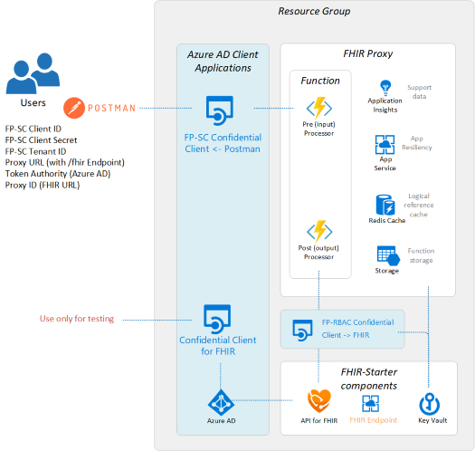

# Challenge-01 - Deploy Azure API for FHIR (PaaS), FHIR-Proxy (OSS), and FHIR-Bulk Loader (OSS)

## Introduction

Welcome to Challenge-01!

In this challenge, you will use an Azure Resource Manager (ARM) template to deploy **Azure API for FHIR** (PaaS), **FHIR-Proxy** (OSS), and **FHIR-Bulk Loader** (OSS). In addition, you will set up a **Postman** environment to make REST API calls to Azure API for FHIR.

## Background
FHIR (Fast Healthcare Interoperability Resources) is the standard format for data storage and exchange in Microsoft's health data platform. Microsoft's FHIR infrastructure rests on two Azure components: [Azure API for FHIR](https://docs.microsoft.com/en-us/azure/healthcare-apis/azure-api-for-fhir/overview) (GA) and [Azure Healthcare APIs](https://azure.microsoft.com/en-us/services/healthcare-apis/) (currently in Public Preview). For this training, we will be focusing on Azure API for FHIR.

In Azure FHIR workflows, Azure API for FHIR receives REST API requests from remote client apps and manages all FHIR data persistance and retrieval tasks. Meanwhile, the open-source [FHIR-Proxy](https://github.com/microsoft/fhir-proxy) acts as a checkpoint surrounding Azure API for FHIR, filtering the incoming and outgoing FHIR data according to a set of admin-defined rules.

For bulk ingestion of FHIR data into Azure API for FHIR, Microsoft offers the open-source [FHIR-Bulk Loader](https://github.com/microsoft/fhir-loader) utility. With FHIR-Bulk Loader, admins can import large amounts of FHIR data with point and click ease (FHIR-Bulk Loader handles API calls to Azure API for FHIR during import). The FHIR-Bulk Loader can import data from FHIR Bundles (compressed and non-compressed) as well as FHIR NDJSON files. 

## Learning Objectives for Challenge-01
+ Understand the Azure API for FHIR - FHIR-Proxy relationship
+ Use an ARM template to deploy Azure API for FHIR, FHIR-Proxy, and FHIR-Bulk Loader
+ Configure AAD authentication for FHIR-Proxy
+ Configure Postman for testing FHIR API calls
+ Make FHIR API calls to Azure API for FHIR

### Azure API for FHIR and FHIR-Proxy Relationship
In the Azure health data platform, FHIR-Proxy acts as a pre- and post- processor, selectively filtering FHIR data on its way into and out of Azure API for FHIR. Admins can set up FHIR-Proxy to listen to the stream of I/O data and trigger custom workflows based on specific FHIR events. FHIR-Proxy also brings enhanced Role-Based Access Control (RBAC) to Azure API for FHIR, allowing fine-grained Client Credential Authorization for REST API actions at the FHIR Resource level. This also provides a means of Role-Based Consent so that users (i.e., patients) can authorize or deny access to certain FHIR data.

Component View of FHIR-Proxy and Azure API for FHIR with AAD [confidential clients](https://docs.microsoft.com/en-us/azure/healthcare-apis/azure-api-for-fhir/register-confidential-azure-ad-client-app) registered for Postman, FHIR-Proxy, and Azure API for FHIR.




## Prerequisites 

Before deploying Azure API for FHIR, FHIR-Proxy, and FHIR-Bulk Loader, please make sure that you have the following permissions in your Azure environment:

+ **Azure Subscription:** User must have rights to deploy resources at the Resource Group scope in their Azure Subscription (i.e. [Contributor](https://docs.microsoft.com/en-us/azure/role-based-access-control/built-in-roles) built-in role).

+ **Azure Active Directory (AAD):** User must have [Application Administrator](https://docs.microsoft.com/en-us/azure/active-directory/roles/permissions-reference#application-administrator) rights for the AAD tenant attached to the Azure Subscription.

For **Step 2** in this challenge, you will need to have [Postman](https://www.getpostman.com/) installed - either the desktop or web client.


## Step 1 - Deploy Azure API for FHIR, FHIR-Proxy, and FHIR-Bulk Loader
In the first part of this challenge, you will
- Visit another repo and read the deployment instructions
- Go to the Azure Portal and begin the process for deploying Azure API for FHIR, FHIR-Proxy, and FHIR-Bulk Loader


To begin, **CTRL+click** (Windows or Linux) or **CMD+click** (Mac) on the link below to visit the fhir-starter quickstart repo (https://github.com/microsoft/fhir-starter/tree/main/quickstarts) in a new browser tab.

Follow the instructions in the repo and return here when finished.


## Step 2 - Set up Postman and test Azure API for FHIR
In the next part of this challenge, you will
- Visit another repo and read the instructions on setting up Postman
- Make API calls to test Azure API for FHIR using Postman

To begin, **CTRL+click** (Windows or Linux) or **CMD+click** (Mac) on the link below to visit the Postman tutorial repo (https://github.com/microsoft/health-architectures/tree/main/Postman) in a new browser tab.

Follow the instructions in the repo and return here when finished.

## What does success look like for Challenge-01?
+ Azure API for FHIR (PaaS) deployed and available
+ FHIR-Proxy (OSS) deployed and able to communicate with Azure API for FHIR
+ FHIR-Bulk Loader (OSS) deployed and available
+ Postman set up and able to connect with Azure API for FHIR
    + Capabilities Statement from the Azure API for FHIR server - received
    ```
    {
    "resourceType": "CapabilityStatement",
    "url": "/metadata",
    "version": "1.0.0.0",
    "name": "Microsoft Azure API for FHIR 2.2.61 Capability Statement",
    "status": "draft",
    "experimental": true,
    "date": "2022-02-18T00:06:47.9408665+00:00",
    "publisher": "Microsoft",
    ...
    }
    ```
    + `POST AuthorizeGetToken` call in Postman to obtain an AAD access token - succeeded
    + `POST Save Patient` call in Postman to populate Azure API for FHIR with a Patient Resource - succeeded
    + `GET List Patients` call in Postman to retrieve a bundle of all Patient Resources stored in Azure API for FHIR - succeeded

## Deployed Components 

Azure API for FHIR and FHIR-Proxy


FHIR-Bulk Loader


## Next Steps

Click [here](<../Challenge-02 - Convert HL7v2 and C-CDA to FHIR/Readme.md>) to proceed to Challenge-02.
