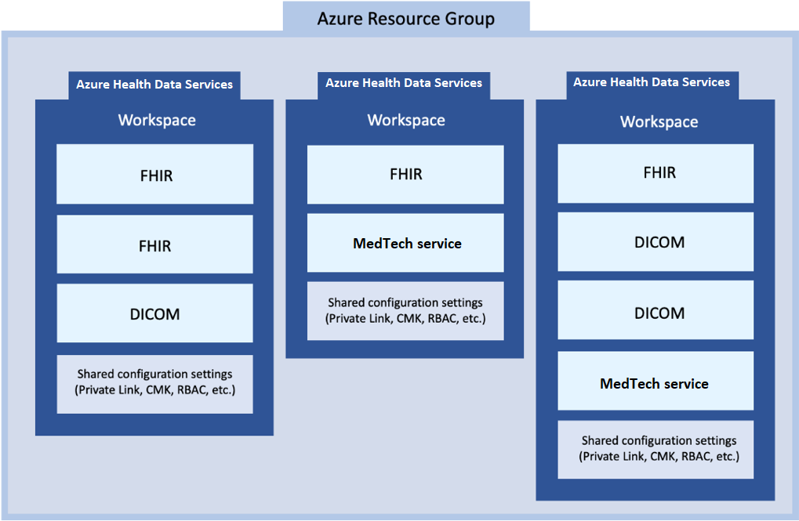

# Challenge-01 - Deploy Azure Health Data Services Workspace and FHIR service

## Introduction

Welcome to Challenge-01!

In this challenge, you will deploy and use an **Azure Health Data Services workspace** with a child **FHIR service**. In addition, you will setup your API testing tool (like **Postman**) and start reading and writing data to FHIR service.

## Learning Objectives for Challenge-01

By the end of this challenge you will be able to:

+ Explain the difference between workspaces and FHIR services in Azure Health Data Services.
+ Use the Azure Portal to deploy Azure an Health Data Services workspace and a FHIR service.
+ Create a client application for you API testing tool and grant it access to your FHIR service.
+ Configure your API testing tool for sending web API request to FHIR service.
+ Use your API testing tool to make FHIR API calls to your FHIR service.

## Background

**FHIR service** is the core component for reading, writing, and querying structured healthcare data inside of Azure Health Data Services. You may have also heard of the Azure API for FHIR, which is Microsoft first generally available product for FHIR. For this training, we will be focusing on the new FHIR service, which has some big advantages over its predecessor (like transactions, Azure Health Data Services workspace level configuration, performance improvements for search, import, and export). Many of these exercises will work with the Azure API for FHIR, but some will not. Please use the FHIR service for this workshop.

### Azure Health Data Services Workspace Relationship with FHIR, DICOM, and MedTech Services

In the Azure health ecosystem, the Azure Health Data Services workspace is a logical container for associated healthcare service instances such as FHIR services, DICOM (Digital Imaging and Communications in Medicine) services, and MedTech services. You can provision multiple data services in a single workspace - you can have multiple FHIR, DICOM, and MedTech services in a single workspace to meet your solution needs.



The workspace also creates a compliance boundary (HIPAA, HITRUST) within which protected health information can travel. This means that configuration such as [Role-Based Access Control (RBAC)](https://docs.microsoft.com/azure/healthcare-apis/configure-azure-rbac), private network data transit with [Private Link](https://docs.microsoft.com/azure/healthcare-apis/healthcare-apis-configure-private-link), and [event messages](https://docs.microsoft.com/azure/healthcare-apis/events/events-deploy-portal) can all be configured at the workspace level, reducing your configuration and management complexity.

## Prerequisites

Before deploying an **Azure Health Data Services workspace** and a **FHIR service**, please make sure that you have the following permissions in your Azure environment.

+ **Azure Subscription:** You must have rights to deploy resources and assign roles at the resource group scope in your Azure subscription (e.g. [Owner](https://docs.microsoft.com/azure/role-based-access-control/built-in-roles#owner) role or [Contributor](https://docs.microsoft.com/azure/role-based-access-control/built-in-roles#contributor) and [User Access Administrator](https://docs.microsoft.com/azure/role-based-access-control/built-in-roles#user-access-administrator)).
  
+ **Azure Active Directory (AAD):** You must have the ability to create application registrations and service principals in your Azure Active Directory (AAD) tenant. You will need the [Application Developer](https://docs.microsoft.com/azure/active-directory/roles/permissions-reference#all-roles) role in your tenant or your tenant needs to have the `Users can register applications` setting is enabled.
  
You will also need to have an API testing tool you are familiar with installed and ready to use (like [Postman](https://www.getpostman.com/) - either the desktop or web client).

## Step 1 - Deploy Azure Health Data Services workspace and FHIR Service

In the first part of this challenge, you will:

+ Use a template to deploy an Azure Health Data Services **workspace** and a **FHIR Service**.

The easiest way to deploy this template is to use the Azure Portal. Please **CTRL+click** (Windows or Linux) or **CMD+click** (Mac) on the **Deploy to Azure** button below to open the deployment form in a new browser tab.

[](https://portal.azure.com/#create/Microsoft.Template/uri/https%3A%2F%2Fraw.githubusercontent.com%2Fmicrosoft%2Fazure-health-data-services-workshop%2Fmay2022-challenge-01%2FChallenge-01%2520-%2520Deploy%2520Azure%2520Health%2520Data%2520Services%2520workspace%2520and%2520FHIR%2520service%2Fresources%2Fdeploy-ahds-with-fhir.json)

The ARM (Azure Resource Manager) template will deploy the following components:

+ [Azure Health Data Services workspace](https://docs.microsoft.com/azure/healthcare-apis/workspace-overview)
+ [FHIR service](https://docs.microsoft.com/azure/healthcare-apis/fhir/overview)

**Important:** Again, in order to successfully deploy resources in this workshop, you must have [Owner](https://docs.microsoft.com/azure/role-based-access-control/built-in-roles#owner) rights for the Azure subscription. 

**Note:**  Before running the ARM template, you should create a new resource group first and check to make sure that you have Owner rights. Once you confirm that you have Owner rights for the resource group, then proceed to run the template and deploy into that resource group.

**Note:** Deployment of **Azure Health Data Services workspace** and **FHIR service** with this template typically takes 8 minutes. You can start reading the next step in the meantime.

## Step 2 - Create an App Registration for Accessing FHIR Service with your API Testing Tool

In the next part of this challenge, you will:

+ Go to the Azure Portal and create an App Registration.
+ Assign your App Registration access to the Azure Health Data Services workspace.

1. Follow the instructions on [this documentation page](https://docs.microsoft.com/azure/healthcare-apis/register-application). You can skip the **API permissions** and **Authentication setting: confidential vs. public** sections as they are not needed. Make sure to save your new application's `name`, `client id`, `client secret`, and the `tenant id` for the next steps and exercises.

2. Next, follow the instructions on [this documentation page](https://docs.microsoft.com/en-us/azure/healthcare-apis/configure-azure-rbac) to assign `FHIR Contributor` access to the App Registration you just created. Try this on your **workspace instead** of the FHIR service to test this concept of Azure Health Data Services workspace hierarchy over child services.

**Important:** Again, in order to interact with Azure Active Directory (AAD) for this workshop, you must be able to create application registrations. You will probably need the [Application Administrator](https://docs.microsoft.com/azure/active-directory/roles/permissions-reference#application-administrator) role in AAD.

## Step 3 - Setup API Testing Tool (Postman) and Send Requests to FHIR Service

In this final step, you will:

+ Setup your API testing tool (like Postman) for interacting with the FHIR service via API requests and responses.
+ Use your API testing tool to make web API calls to test the FHIR service.

**Note:** The rest of the instructions in this challenge and workshop will assume you are using Postman, as it's the recommended API testing tool. If you prefer another tool, please use it!

1. Open Postman on your computer. If you get stuck using Postman, review at the resources at the bottom of [Challenge-00](<../Challenge-00 - Check Prerequisites and Configure Environment>).

2. Follow the instructions on [this documentation page](https://docs.microsoft.com/azure/healthcare-apis/fhir/use-postman) to create a Postman environment and create and get a FHIR resource from the FHIR service. Skip the **Export FHIR data** section at the end as exporting is covered in Challenge-05.

3. Run the `GET /Patient` request again in Postman to show you successfully created a patient resource in the FHIR service.

## What does success look like for Challenge-01?

+ Azure Health Data Services workspace deployed and available in Azure.
+ FHIR service deployed and available in Azure.
+ Client application created in Azure Active Directory for use with FHIR service.
+ `FHIR Contributor` role assigned to your App Registration at the workspace level.
+ Postman set up and able to connect with FHIR service.
  + Successful `GET /metadata` request response to show FHIR capability statement.

    ```json
    {
        "resourceType": "CapabilityStatement",
        "url": "/metadata",
        "version": "1.0.0.0",
        "name": "Microsoft FHIR service 2.2.61 Capability Statement",
        "status": "draft",
        "experimental": true,
        "date": "2022-02-18T00:06:47.9408665+00:00",
        "publisher": "Microsoft",
        "more below ..." : "..."
    }
    ```

  + Successful `POST` call to get an AAD access token in Postman.
  + Successful `POST Save Patient` call in Postman to populate FHIR service with a Patient resource.
  + Successful `GET List Patients` call in Postman to retrieve a bundle of all Patient resources stored in FHIR service.

## Next Steps

Click [here](<../Challenge-02 - Convert HL7v2 and C-CDA to FHIR/Readme.md>) to proceed to Challenge-02.

## More Resources

+ [FHIR Service Overview](https://docs.microsoft.com/azure/healthcare-apis/fhir/overview)
+ [Differences between FHIR service and Azure API for FHIR](https://docs.microsoft.com/azure/healthcare-apis/fhir/fhir-faq#what-is-the-difference-between-azure-api-for-fhir-and-the-fhir-service-in-the-azure-health-data-services)
+ [Azure API for FHIR Overview](https://docs.microsoft.com/azure/healthcare-apis/azure-api-for-fhir/overview)
