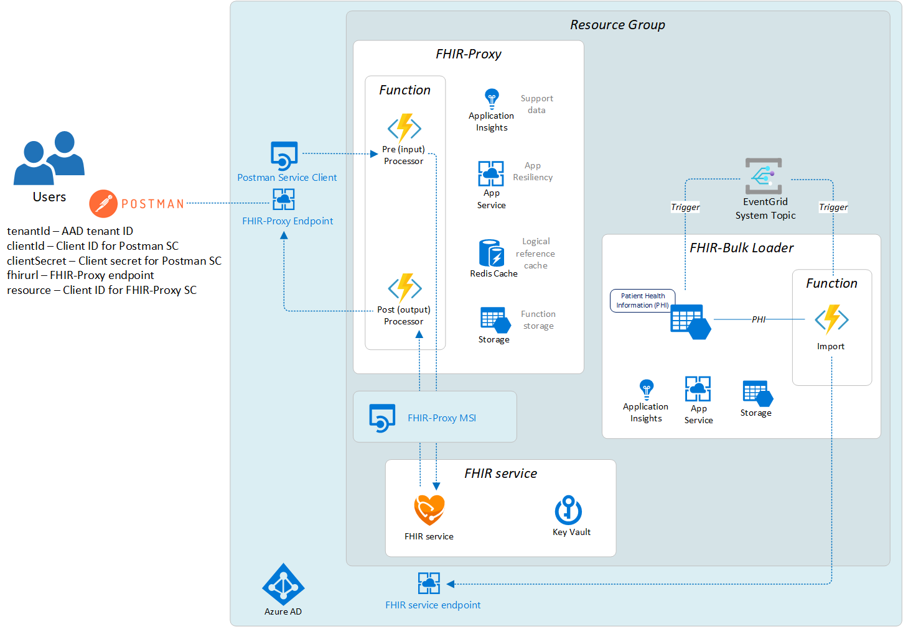

# Challenge-01 - Deploy Azure Health Data Services Workspace and FHIR service

## Introduction

Welcome to Challenge-01!

In this challenge, you will use an Azure Health Data Services **workspace** with a **FHIR service**. In addition, you will set up a **Postman** environment to make application programming interface (API) calls to the FHIR service.

## Background

FHIR (Fast Healthcare Interoperability Resources) is the standard format for data storage and exchange in Microsoft's health data platform. Microsoft currently has two FHIR offerings: [FHIR service](https://docs.microsoft.com/en-us/azure/healthcare-apis/fhir/overview) (PaaS) and [Azure API for FHIR](https://docs.microsoft.com/en-us/azure/healthcare-apis/azure-api-for-fhir/overview) (PaaS). For this training, we will be focusing on the new FHIR service, which is a core component of [Azure Health Data Services](https://docs.microsoft.com/en-us/azure/healthcare-apis/). This new service offers additional technologies and advantages over the Azure API for FHIR. Check out [this page](https://docs.microsoft.com/en-us/azure/healthcare-apis/fhir/fhir-faq#what-is-the-difference-between-azure-api-for-fhir-and-the-fhir-service-in-the-azure-health-data-services) for more comparison information.

In Azure FHIR workflows, the FHIR service receives REST API requests from remote client apps and manages all FHIR data persistance and retrieval tasks. Meanwhile, the open-source [FHIR-Proxy](https://github.com/microsoft/fhir-proxy) acts as a checkpoint surrounding FHIR service, filtering the incoming and outgoing FHIR data according to a set of admin-defined rules.

For bulk ingestion of FHIR data into FHIR service, Microsoft offers the open-source [FHIR-Bulk Loader](https://github.com/microsoft/fhir-loader) utility. With FHIR-Bulk Loader, admins can import large amounts of FHIR data with point and click ease. We will be working with FHIR-Bulk Loader in Challenge-03.

## Learning Objectives for Challenge-01

By the end of this challenge you will be able to 

+ Explain the difference between workspaces and FHIR service in Azure Health Data Services
+ Use the Azure Portal to deploy Azure an Health Data Services workspace and a FHIR service 
+ Create a client application and assign access for accessing FHIR service
+ Configure Postman for testing FHIR API calls
+ Use Postman to make FHIR API calls to FHIR service

### Azure Health Data Services Workspace Relationship with FHIR, DICOM, and MedTech Services

In the Azure health data platform, the Azure Health Data Services workspace is a logical container for all your healthcare service instances such as Fast Healthcare Interoperability Resources (FHIR) services, Digital Imaging and Communications in Medicine (DICOM) services, and MedTech service. You can provision multiple data services in a single workspace - you can have multiple FHIR, DICOM, and MedTech services in a workspace to meet your needs.


The workspace also creates a compliance boundary (HIPAA, HITRUST) within which protected health information can travel. This means that configuration such as [Role-Based Access Control (RBAC)](https://docs.microsoft.com/en-us/azure/healthcare-apis/configure-azure-rbac), private networking with [Private Link](https://docs.microsoft.com/en-us/azure/healthcare-apis/healthcare-apis-configure-private-link), and [event messages](https://docs.microsoft.com/en-us/azure/healthcare-apis/events/events-deploy-portal) can all be configured at the workspace level, reducing your configuration and management complexity.

Component View of Azure Health Data Services workspace containing FHIR service, DICOM service, MedTech service.


## Prerequisites 

Before deploying **Azure Health Data Services workspace** and **FHIR service**, please make sure that you have the following permissions in your Azure environment.

+ **Azure Subscription:** You must have rights to deploy resources and assign roles at the resource group scope in your Azure subscription (e.g. [Owner](https://docs.microsoft.com/en-us/azure/role-based-access-control/built-in-roles#owner) role or [Contributor](https://docs.microsoft.com/en-us/azure/role-based-access-control/built-in-roles#contributor) and [User Access Administrator](https://docs.microsoft.com/en-us/azure/role-based-access-control/built-in-roles#user-access-administrator)).
  
+ **Azure Active Directory (AAD):** You must have the ability to create applications and service principals in your Azure Active Directory (AAD) tenant. You will need the [Application Developer](https://docs.microsoft.com/en-us/azure/active-directory/roles/permissions-reference#all-roles) role in your tenant or your tenant needs to have the `Users can register applications` setting is enabled.
  
You will also need to have [Postman](https://www.getpostman.com/) installed - either the desktop or web client.

## Step 1 - Create an App Registration for Accessing FHIR Service with Postman

In the first part of this challenge, you will

+ Visit another repo and read the deployment instructions
+ Go to the Azure Portal and create an Application Registration

Follow the instructions on [this documentation page](https://docs.microsoft.com/en-us/azure/healthcare-apis/register-application). You can skip the **API permissions** and **Authentication setting: confidential vs. public** sections as they are not needed. Make sure to save your new application's `client id`, `client secret`, and the `tenant id` for the next steps and exercises.


## Step 2 - Deploy FHIR service, FHIR-Proxy, and FHIR-Bulk Loader

In the next part of this challenge, you will

+ Go to the Azure Portal and deploy an Azure Health Data Services **workspace** and a **FHIR Service**.

To begin, **CTRL+click** (Windows or Linux) or **CMD+click** (Mac) on the **Deploy to Azure** button below to open the deployment form in a new browser tab.

[](https://portal.azure.com/#create/Microsoft.Template/uri/https%3A%2F%2Fraw.githubusercontent.com%2Fmicrosoft%2Fazure-health-data-services-workshop%2Fmay2022-challenge-01%2Fdeploy-ahds-with-fhir.bicep)

The ARM/Bicep template will deploy the following components:

+ [Azure Health Data Services workspace](https://docs.microsoft.com/en-us/azure/healthcare-apis/workspace-overview)
+ [FHIR service](https://docs.microsoft.com/en-us/azure/healthcare-apis/fhir/overview)
+ [Role assignment for Postman client](https://docs.microsoft.com/en-us/azure/role-based-access-control/)

__Important:__ In order to successfully deploy resources with this ARM template, the user must have [Owner](https://docs.microsoft.com/en-us/azure/role-based-access-control/built-in-roles#owner) rights for the [Resource Group](https://docs.microsoft.com/en-us/azure/azure-resource-manager/management/manage-resource-groups-portal) where the components are deployed. Additionally, the user must have the [Application Administrator](https://docs.microsoft.com/en-us/azure/active-directory/roles/permissions-reference#application-administrator) role in AAD in order to create application registrations.

__Note:__  Before running the ARM template, it is recommended to create a new resource group first and check to make sure that you have Owner rights. Once you confirm that you have Owner rights for the resource group, then proceed to run the template and deploy into that resource group.

## What does success look like for Challenge-01?
+ FHIR service (PaaS) deployed and available
+ FHIR-Proxy (OSS) deployed and able to communicate with FHIR service
+ FHIR-Bulk Loader (OSS) deployed and available
+ Postman set up and able to connect with FHIR service (via FHIR-Proxy)
    + Capability Statement from the FHIR service - received
    ```
    {
    "resourceType": "CapabilityStatement",
    "url": "/metadata",
    "version": "1.0.0.0",
    "name": "Microsoft FHIR service 2.2.61 Capability Statement",
    "status": "draft",
    "experimental": true,
    "date": "2022-02-18T00:06:47.9408665+00:00",
    "publisher": "Microsoft",
    ...
    }
    ```
    + `POST AuthorizeGetToken` call in Postman to obtain an AAD access token - succeeded
    + `POST Save Patient` call in Postman to populate FHIR service with a Patient Resource - succeeded
    + `GET List Patients` call in Postman to retrieve a bundle of all Patient Resources stored in FHIR service - succeeded

## Deployed Components 

FHIR service, FHIR-Proxy, and FHIR-Bulk Loader



## Next Steps

Click [here](<../Challenge-02 - Convert HL7v2 and C-CDA to FHIR/Readme.md>) to proceed to Challenge-02.
