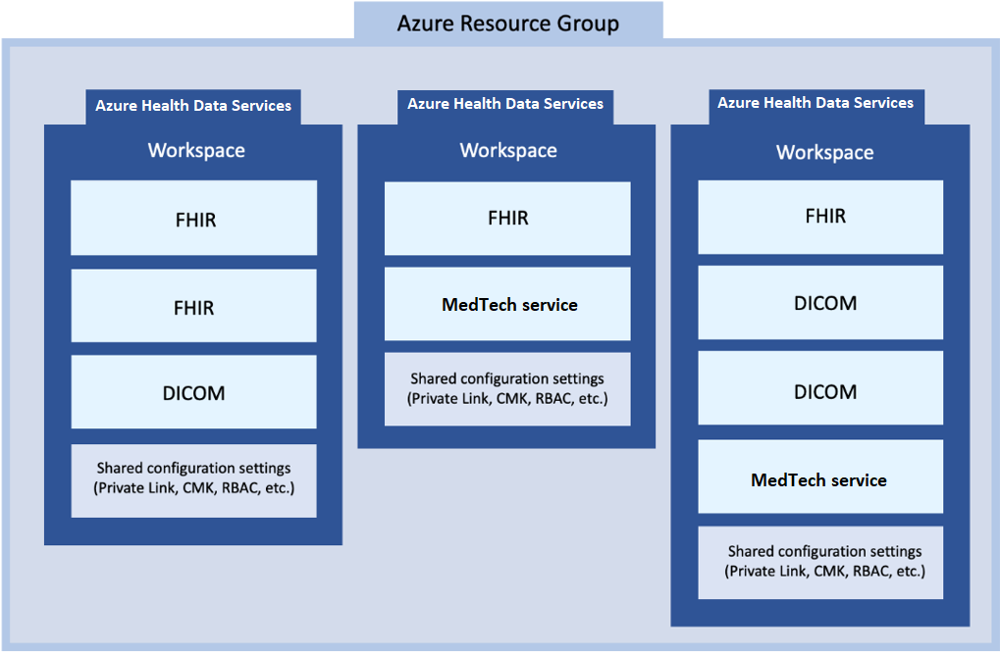

# Challenge-01 - Deploy FHIR Service and Azure Health Data Services Workspace

## Introduction

Welcome to Challenge-01!

In this challenge, you will deploy and use an **Azure Health Data Services workspace** containing a **FHIR service**. In addition, you will setup **Postman** as your API testing tool for reading and writing data to your FHIR service.

## Learning Objectives for Challenge-01

By the end of this challenge you will be able to:

+ Explain the difference between workspaces and FHIR services in Azure Health Data Services.
+ Use a template to deploy a FHIR service inside of an Azure Health Data Services workspace.
+ Create a client application for Postman and grant it access to your FHIR service.
+ Configure Postman for sending web API request to your FHIR service.
+ Use your API testing tool to make FHIR API calls to your FHIR service.

## Background

**FHIR service** is the core component for reading, writing, and querying structured healthcare data inside of Azure Health Data Services. You may have also heard of the Azure API for FHIR, which is Microsoft first generally available product for FHIR. For this training, we will be focusing on the new FHIR service, which has some big advantages over its predecessor (like transactions, Azure Health Data Services workspace level configuration, performance improvements for search, import, and export). Many of these exercises will work with the Azure API for FHIR, but some will not. Please use the FHIR service for this workshop.

### Azure Health Data Services Workspace Relationship with FHIR, DICOM, and MedTech Services

In the Azure health ecosystem, the Azure Health Data Services workspace is a logical container for associated healthcare service instances such as FHIR services, DICOM (Digital Imaging and Communications in Medicine) services, and MedTech services. You can provision multiple data services in a single workspace - you can have multiple FHIR, DICOM, and MedTech services in a single workspace to meet your solution needs.



The workspace also creates a compliance boundary (HIPAA, HITRUST) within which protected health information can travel. This means that configuration such as [Role-Based Access Control (RBAC)](https://docs.microsoft.com/azure/healthcare-apis/configure-azure-rbac), private network data transit with [Private Link](https://docs.microsoft.com/azure/healthcare-apis/healthcare-apis-configure-private-link), and [event messages](https://docs.microsoft.com/azure/healthcare-apis/events/events-deploy-portal) can all be configured at the workspace level, reducing your configuration and management complexity.

## Prerequisites

Before deploying an **Azure Health Data Services workspace** and a **FHIR service**, please make sure that you have the following permissions in your Azure environment.

+ **Azure Subscription:** You must have rights to deploy resources at the Resource Group scope in your Azure Subscription (i.e. [Owner](https://docs.microsoft.com/azure/role-based-access-control/built-in-roles#owner) role).

+ **Azure Active Directory (AAD):** You must have [Application Administrator](https://docs.microsoft.com/en-us/azure/active-directory/roles/permissions-reference#application-administrator) rights for the AAD tenant attached to the Azure Subscription.

You will also need to have [Postman](https://www.getpostman.com/) installed - either the desktop or web client.

## Step 1: Deploy FHIR Service, Azure Health Data Services workspace, and Workshop Dependencies

In the first part of this challenge, you will:

+ Visit another repo and read the deployment instructions
+ Use a template to deploy resources to the Azure Portal. You're going to deploy *more* than what is needed in this challenge to prepare you for future challenges. This template will deploy:
  + Azure Health Data Services workspace
  + FHIR service
  + FHIR Loader (for Challenge-03)
  + FHIR Proxy (for Challenge-07)

To begin, **CTRL+click** (Windows or Linux) or **CMD+click** (Mac) on the link below to open the FHIR-Starter quickstarts folder in a new browser tab.

https://github.com/microsoft/fhir-starter/tree/main/quickstarts 

Follow the instructions and return here when finished.

## Step 2 - Set up Postman and test FHIR service

In the next part of this challenge, you will:

+ Visit another repo and follow the instructions on setting up Postman
+ Make API calls to test FHIR service using Postman

To begin, **CTRL+click** (Windows or Linux) or **CMD+click** (Mac) on the link below to open a Postman tutorial in a new browser tab.

[https://github.com/microsoft/health-architectures/tree/main/Postman](https://github.com/microsoft/health-architectures/tree/main/Postman)

Follow the instructions and return here when finished.

## What does success look like for Challenge-01?

+ Azure Health Data Services workspace and FHIR service deployed and available in Azure.
+ FHIR Proxy and Bulk Loader deployed in Azure for future challenges.
+ Client application created in Azure Active Directory for use with Postman and your FHIR service.
+ Postman set up and able to connect with you FHIR service.
  + Capability Statement from your FHIR service - received.

    ```json
    {
        "resourceType": "CapabilityStatement",
        "url": "/metadata",
        "version": "1.0.0.0",
        "name": "Microsoft FHIR service 2.2.61 Capability Statement",
        "status": "draft",
        "experimental": true,
        "date": "2022-02-18T00:06:47.9408665+00:00",
        "publisher": "Microsoft",
        "more below ..." : "..."
    }
    ```

  + `POST AuthorizeGetToken` call in Postman to obtain an AAD access token - succeeded.
  + `POST Save Patient` call in Postman to populate FHIR service with a Patient Resource - succeeded.
  + `GET List Patients` call in Postman to retrieve a bundle of all Patient Resources stored in FHIR service - succeeded.

## Next Steps

Click [here](<../Challenge-02 - Convert HL7v2 and C-CDA to FHIR/Readme.md>) to proceed to Challenge-02.

## More Resources

+ [FHIR Service Overview](https://docs.microsoft.com/azure/healthcare-apis/fhir/overview)
+ [Differences between FHIR service and Azure API for FHIR](https://docs.microsoft.com/azure/healthcare-apis/fhir/fhir-faq#what-is-the-difference-between-azure-api-for-fhir-and-the-fhir-service-in-the-azure-health-data-services)
+ [Azure API for FHIR Overview](https://docs.microsoft.com/azure/healthcare-apis/azure-api-for-fhir/overview)