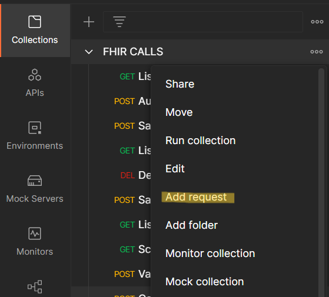
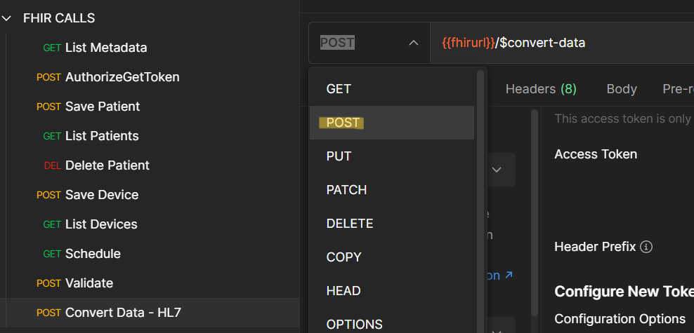
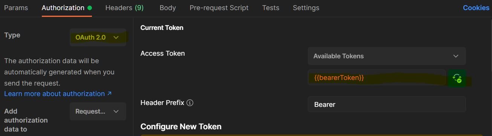
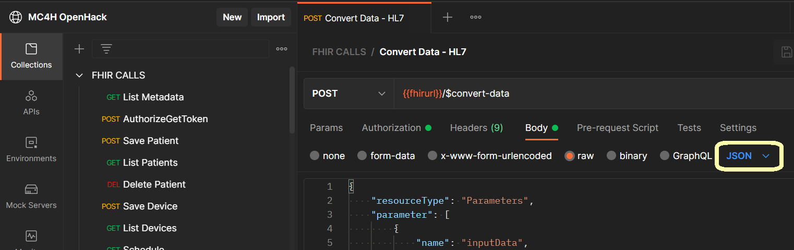

# Challenge-02 - Convert HL7v2 and C-CDA to FHIR

## Introduction

Welcome to Challenge-02!

In this challenge, you will learn how to use FHIR service's custom `$convert-data` operation to convert HL7v2 and C-CDA files into FHIR.

## Background

In today's health industry, the FHIR R4 format has become the standard medium for storage and exchange of health data. As FHIR interoperability spreads throughout the industry, health IT operations are deploying conversion pipelines for ingesting and transforming legacy data formats into FHIR. Two of the most common legacy formats in use are [HL7v2](https://www.hl7.org/implement/standards/product_brief.cfm?product_id=185) and [C-CDA](https://www.healthit.gov/topic/standards-technology/consolidated-cda-overview). In this challenge, we will explore how to convert data from these formats for persistence in FHIR using the Microsoft health data platform.

## Learning Objectives for Challenge-02

+ Convert HL7v2 and C-CDA data into FHIR
+ Specify API request parameters for converting data into FHIR
+ Prepare/clean data for conversion into FHIR
+ Make API calls using the `$convert-data` operation

## Prerequisites

+ Successful completion of Challenge-01
+ Postman installed
+ A text editor - [VS Code](https://code.visualstudio.com/) or [7Edit](http://7edit.com/home/)
+ [VS Code HL7 Language Support](https://marketplace.visualstudio.com/items?itemName=pbrooks.hl7) (optional)

---

## Step 1 - Prepare an API request to convert HL7v2 into FHIR
To convert data into FHIR, you must call FHIR service with a `$convert-data` API request.

1. Go to Postman and create a new API request by clicking `Add request` in the `FHIR CALLS` collection imported in Challenge-01.
 

2. Rename the new request to `Convert Data - HL7`.
3. Change the HTTP operation type from **GET** to **POST**.
4. Fill in the URL of this request with `{{fhirurl}}/$convert-data`. 
  

5. Go to the **Authorization** tab of the request and change:
    + **Type** to **OAuth 2.0**
    + Add `{{bearerToken}}` as the **Access Token**

    + 
6. Be sure to `Save` the `Convert Data - HL7` request.

## Step 2 - Set up Request Parameters

1.	Review the instructions for the ```$convert-data``` operation in the FHIR service [documentation](https://docs.microsoft.com/en-us/azure/healthcare-apis/fhir/convert-data). 

2. 	Click on [ADT_A01.hl7](./samples/ADT_A01.hl7) to view a sample HL7v2 message. 

3.	Copy and paste the HL7v2 message into the `Body` of the `Convert Data – HL7` request that you created in Postman*.

4.  Select the `raw` button and choose `JSON` from the dropdown menu on the right.
 

5.	You will need to make some changes to the the HL7v2 message so that the formatting follows the sample request featured in the `$convert-data` [documentation](https://docs.microsoft.com/en-us/azure/healthcare-apis/fhir/convert-data). 

    __Hint:__ In the sample request in the documentation (midway through page), look at the `\n` newline characters included in the HL7v2 payload. 

    *Optional – prepare the HL7v2 message in VS Code (with the HL7 extension installed) or in 7Edit first before pasting into the body of the Postman request.

6. Make sure to `Save` the `Convert Data - HL7` request.

## Step 3 - Convert Data

1. Get a new access token from AAD via Postman (`POST AuthorizeGetToken`).
2. Go back to the `Convert Data - HL7` request and press `Send`.

After making the call, you should receive a FHIR bundle response containing the HL7v2 message converted into FHIR. 

## Step 4 - Convert C-CDA Data

1. Click on `Add request` again to create another API request in the `FHIR CALLS` collection imported in Challenge-01. 
 

2. Rename the new request to `Convert Data - CCDA`.
3. Change the HTTP operation type from **GET** to **POST**.
4. Fill in the URL of this request with `{{fhirurl}}/$convert-data`. 
 

5. Go to the **Authorization** tab of the request and change:
    + **Type** to **OAuth 2.0**
    + Add `{{bearerToken}}` as the **Access Token**

    + 

## Step 5 - Set up Request Parameters

1. Click on [CCDA_Ford_Elaine.xml](./samples/CCDA_Ford_Elaine.xml) to view a sample C-CDA data file.

2. Copy and paste the C-CDA data into VS Code or a text editor of your choice. 

3. Refer back to the FHIR service [documentation](https://docs.microsoft.com/en-us/azure/healthcare-apis/fhir/convert-data) for ```$convert-data``` on how to include parameters in the API request. 

4. Select the `raw` button and choose `JSON` from the dropdown menu on the right.
 

5. You will need to format the C-CDA data so that it sits correctly in the JSON request body.

    __Hint:__ Look closely at the `""` quotation marks. All JSON keys and values must be surrounded by double quotes. Any double quotes *within* these surrounding quotes must be escaped, however.

6. When ready, copy and paste the C-CDA data into the body of the `Convert Data - CCDA` request in Postman.

## Step 6 - Convert Data

1. Get a new access token from AAD via Postman (`POST AuthorizeGetToken`).
2. Execute the `Convert Data - CCDA` request.

> Note: If it doesn't work, you may want to check to make sure that characters are properly escaped in the C-CDA text.

## What does success look like for Challenge-02?

+ Successfully receive a FHIR bundle response after calling ```$convert-data``` with HL7v2 data.
+ Successfully receive a FHIR bundle response after calling ```$convert-data``` with C-CDA data.

## Next Steps

Click [here](<../Challenge-03 - Ingest to FHIR/Readme.md>) to proceed to Challenge-03.
