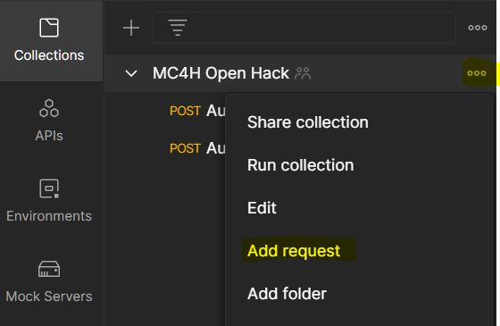

# Challenge-02 - Convert HL7v2 and C-CDA to FHIR

## Introduction

Welcome to Challenge-02!

In this challenge you will learn how to use Azure API for FHIR's custom `$convert-data` operation to convert HL7v2 and C-CDA files into FHIR.

## Background

In today's health industry, the FHIR R4 format has become the industry standard for storage and exchange of health data. As FHIR interoperability spreads throughout the industry, health IT operations are deploying conversion pipelines for ingesting and transforming legacy data formats into FHIR. Two of the most common legacy formats still in use are [HL7v2](https://www.hl7.org/implement/standards/product_brief.cfm?product_id=185) and [C-CDA](https://www.healthit.gov/topic/standards-technology/consolidated-cda-overview). In this challenge, we will explore how to convert these formats into FHIR using the Microsoft health data platform.

## Learning Objectives

+ Specify API request parameters for converting data into FHIR
+ Prepare/clean data for conversion into FHIR
+ Make API calls to convert HL7v2 and C-CDA data into FHIR

## Prerequisites

+ Successful completion of Challenge-01
+ Postman installed
+ A text editor - [VS Code](https://code.visualstudio.com/) or [7Edit](http://7edit.com/home/) (recommended)
+ [VS Code HL7 Language Support](https://marketplace.visualstudio.com/items?itemName=pbrooks.hl7) (optional)

---

## Step 1 - Postman Setup

1. Create a new API request by clicking `Add request` in the `FHIR CALLS` Postman collection imported in Challenge-01.

2. Rename the new request to `Convert Data - HL7`.
3. Change the HTTP operation type from **GET** to **POST**.
4. Fill in the URL of this request with `{{fhirurl}}/$convert-data`.
5. Change to the **Authorization** tab of the request and change:
    + **Type** to **OAuth 2.0**
    + Add `{{bearerToken}}` as the **Access Token**

    + 

## Step 2 - Set up Request Parameters

1.	Review the instructions for the ```$convert-data``` operation in the Azure API for FHIR [documentation](https://docs.microsoft.com/en-us/azure/healthcare-apis/azure-api-for-fhir/convert-data). 

2. 	Click on [ADT_A01.hl7](./samples/ADT_A01.hl7) to view a sample HL7v2 message. 

3.	Copy and paste the HL7v2 message into the body of the `Convert Data – HL7` request that you created in Postman*.

4.	After you paste the HL7v2 message, you will need to make some character alterations so that the formatting of the message follows the example given in the `$convert-data` [documentation](https://docs.microsoft.com/en-us/azure/healthcare-apis/azure-api-for-fhir/convert-data).

*Optional – prepare the HL7v2 message in VS Code (with the HL7 extension installed) or in 7Edit first before pasting into the body of the Postman request.

## Step 3 - Convert Data

1. Get a new access token from AAD via Postman (`POST AuthorizeGetToken`).
2. Execute the `Convert Data - HL7` request.

After making the call, you should receive a FHIR bundle response with the HL7v2 data. 

## Step 4 - Convert C-CDA Data

1. Click on `Add request` again to create another API request in the `FHIR CALLS` collection imported in Challenge-01.

2. Rename the new request to `Convert Data - CCDA`.
3. Change the HTTP operation type from **GET** to **POST**.
4. Fill in the URL of this request with `{{fhirurl}}/$convert-data`.
5. Change to the **Authorization** tab of the request and change:
    + **Type** to **OAuth 2.0**
    + Add `{{bearerToken}}` as the **Access Token**

    + 

## Step 5 - Set up Request Parameters

1. Click on [CCDA_Ford_Elaine.xml](./samples/CCDA_Ford_Elaine.xml) to view a sample C-CDA data file.

2. Copy and paste the C-CDA data into VS Code or a text editor of your choice. 

3. Refer back to the Azure API for FHIR [documentation](https://docs.microsoft.com/en-us/azure/healthcare-apis/azure-api-for-fhir/convert-data) for ```$convert-data``` on how to create a parameter request.

4. You will need to format the C-CDA data so that it sits correctly in the JSON request body.

5. When ready, copy and paste the C-CDA data into the body of the `Convert Data - CCDA` request in Postman.

## Step 6 - Convert Data

1. Get a new access token from AAD via Postman (`POST AuthorizeGetToken`).
2. Execute the `Convert Data - CCDA` request.

> Note: If it doesn't work, you may want to check to make sure that characters are properly escaped in the C-CDA text.

## What does success look like for Challenge-02?

+ Successfully receive a FHIR bundle response after calling ```$convert-data``` with HL7v2 data.
+ Successfully receive a FHIR bundle response after calling ```$convert-data``` with C-CDA data.

## Next Steps

Click [here](../Challenge-03/Readme.md) to proceed to the next challenge.
