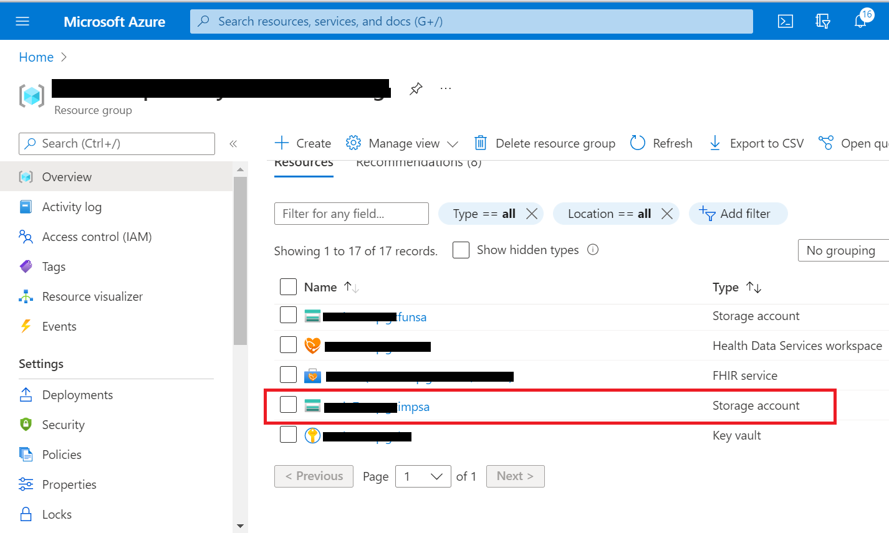
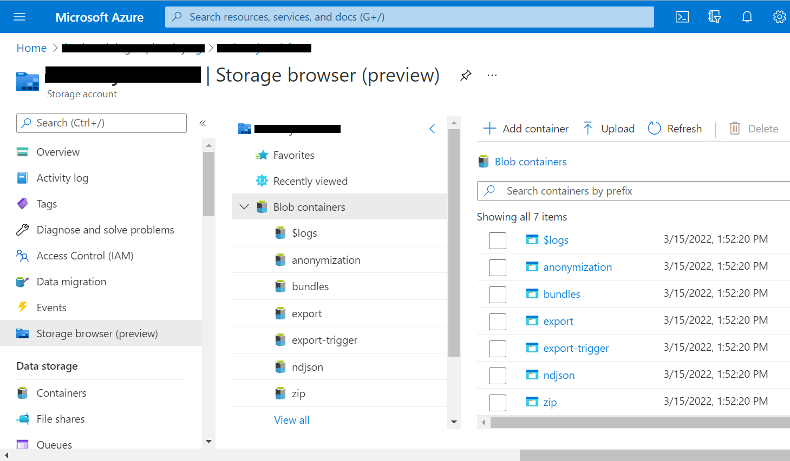
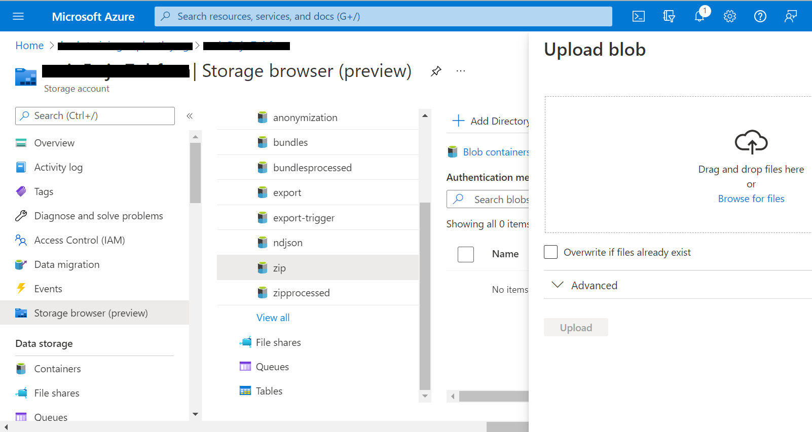
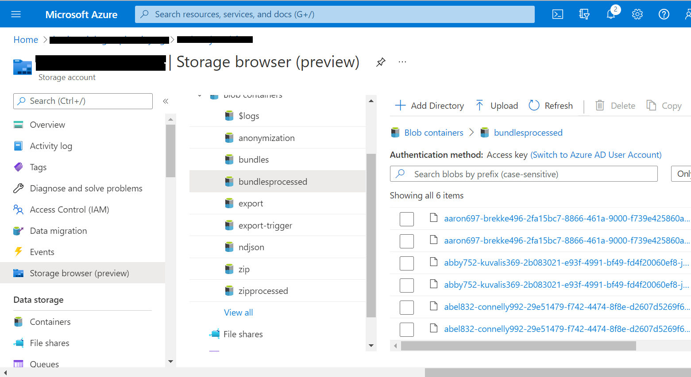
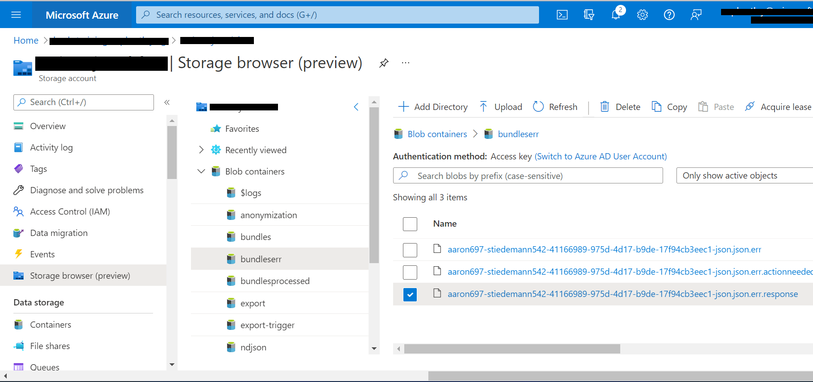
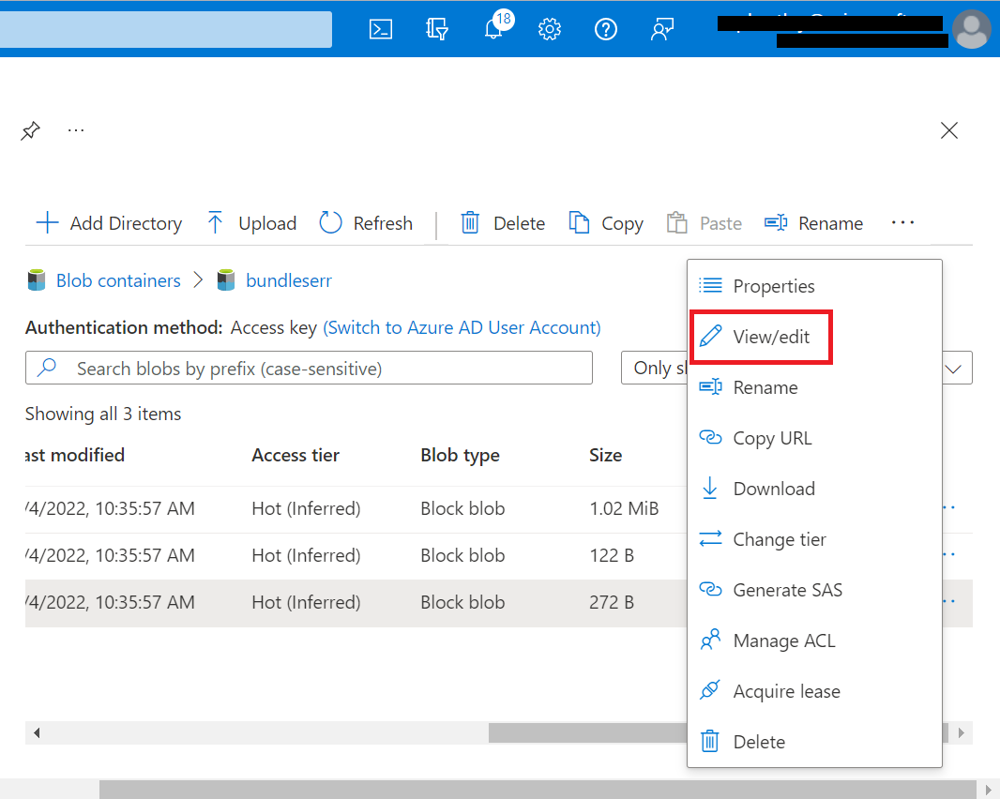
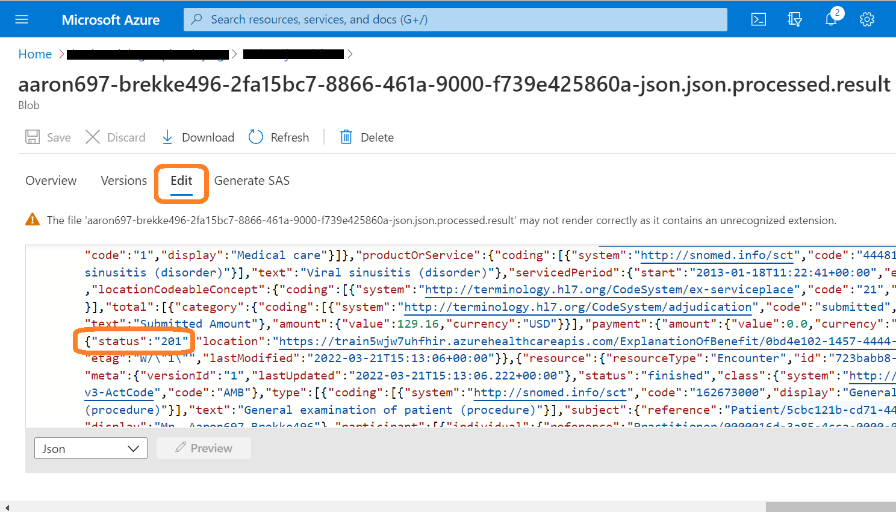

# Challenge-03 - Ingest to FHIR

## Introduction

Welcome to Challenge-03!

In this challenge, you will learn how to use the [FHIR Loader](https://github.com/microsoft/fhir-loader) utility to ingest FHIR data into the FHIR service.

## Background

Data ingestion into FHIR is a vital capability for a healthcare organization's integration with multiple health data systems. While the FHIR service does features a custom `$import` operation for data ingestion, it is only recommended for the *initial* transfer of data into the FHIR service (data loading at high speeds). Alternate approaches can be used for the ongoing, transactional loading of FHIR data. In this challenge, we will be using Microsoft's FHIR Loader (OSS) utility, which is an Azure Function App built for importing data into the FHIR service. 

## Learning Objectives for Challenge-03
By the end of this challenge you will be able to 

+ Ingest FHIR data into FHIR service with FHIR Loader
+ Identify issues in loading FHIR bundles
+ Recognize data constraints with FHIR Loader
+ Track and compare FHIR Loader operations

### FHIR service and FHIR Loader Relationship 
The open-source [FHIR Loader](https://github.com/microsoft/fhir-loader) is designed to ease the process of FHIR data import into the FHIR service. The operation simply involves uploading FHIR data files to Azure blob storage, and from there the FHIR Loader automatically transfers the data for persistence in the FHIR service database. The user may upload FHIR Bundles in regular JSON format (.zip compressed or non-compressed) or NDJSON format (non-compressed). Operationally, FHIR Loader works by making parallel asynchronous API calls to the FHIR service.

Below is a component view of FHIR service with FHIR Loader and FHIR-Proxy.  

## Prerequisites
+ Successful completion of Challenge-01
+ A text editor (e.g., [Visual Studio Code](https://code.visualstudio.com/))

## Getting Started
For this challenge, you will upload FHIR data bundles for import into FHIR service. You will need to examine error logs and determine what is preventing the data in one of the bundles from being ingested.

## Step 1 - Download Sample Data

Start by downloading these two .zip files to your desktop (when you click the links, you will see a `download` button on the right). 
+ [good_bundles.zip](./samples/good_bundles.zip) 
+ [bad_bundles.zip](./samples/bad_bundles.zip) 

## Step 2 - Use FHIR Loader to upload data

Visit the FHIR Loader (OSS) repository [here](https://github.com/microsoft/fhir-loader) and read the documentation for more info on the operating principles of the application. 

1. In Azure Portal, navigate to the Blob Storage account that was created for FHIR Loader in Challenge-01. Go to **Portal -> Resource Group -> Storage account** (the name of the Storage account will end in **"impsa"**).

2. In the Storage account, click on the **Storage browser (preview)** blade and then click on **Blob containers**. 

3. Click on the **zip** container and upload the `good_bundles.zip` file downloaded in Step 1 of this challenge.

 

+ Once you click **Upload**, the FHIR Loader will automatically import the data from the .zip file into the FHIR service database.

4. Now, when you do a refresh and click on **bundlesprocessed**, you should see six files as shown below.

_Note: If you upload a .zip file, the names of the bundles within the .zip archive are exposed (not the .zip filename itself)._

 

## Step 3 - Debug issues with importing FHIR data 

1. Now try importing the `bad_bundles.zip` file that you downloaded in Step 1 of this challenge. Upload the file to the same container where you uploaded the `good_bundles.zip` file.

2. What happens as a result? Go ahead and unzip the `bad_bundles.zip` archive. Open and inspect the contained JSON bundle in a text editor (e.g., VS Code). You can compare this JSON bundle with the JSON bundles in the `good_bundles.zip` archive.

> Refer to the Troubleshooting section below or the FHIR Loader [testing](https://github.com/microsoft/fhir-loader/blob/main/docs/testing.md) documentation for information on tracking issues in FHIR data ingestion. 

## Troubleshooting 
Here are some points for inspecting FHIR Loader operations:

+ In **Storage browser (preview)**, go to **Container** -> **bundleserr** to view info about errors in importing FHIR bundles.  

     

+ Find the **.response** file and click on the three dots (···) located on the right-hand side of the file. Then click **View/edit**.

     

+ What is the reason given for the error?

+ In comparison, you can go to **bundlesprocessed** and look in the `.result` files for ingest operations that succeeded. For example, in the image below there is a `201` status code, meaning success. The response shows an endpoint for a FHIR Resource `ExplanationOfBenefit/<resourceId>`, indicating that this Resource (`ExplanationOfBenefit/<resourceId>`) has been successfully persisted in FHIR service from the ingest operation. 

    

## What does success look like for Challenge-03?

+ Successfully upload and import data from the file `good_bundles.zip`.
+ Successfully identify the problem in the `bad_bundles.zip` file. Use the Troubleshooting tips above for help. 
+ Identify **issues to address in production** to avoid problems when ingesting FHIR data into FHIR service. 

## Next Steps

Click [here](<../Challenge-04 - Query and Search FHIR/Readme.md>) to proceed to Challenge-04.
