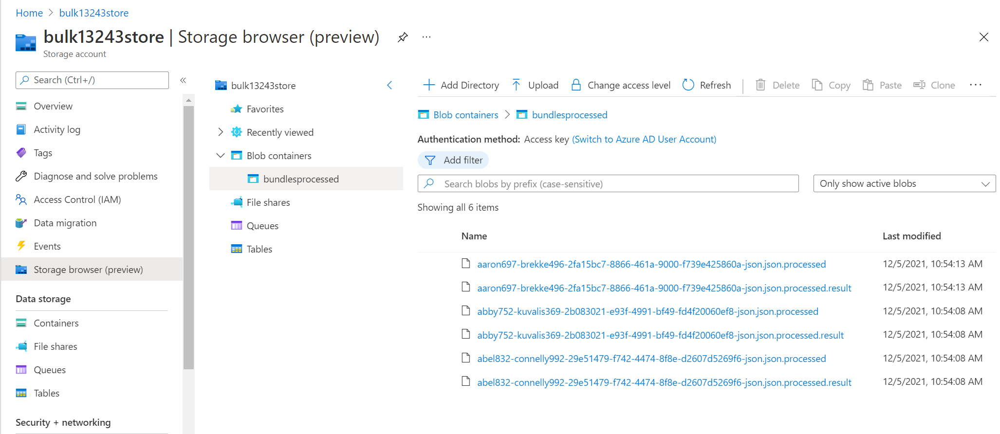

# Challenge-03 - Ingest to FHIR

## Introduction

Welcome to Challenge-03!

In this challenge, you will learn how to use the [FHIR-Bulk Loader](https://github.com/microsoft/fhir-loader) utility to bulk-ingest FHIR data into Azure API for FHIR.

## Background

Bulk FHIR data ingestion is a vital capability for managing FHIR data operations at scale. Since there is no official `$import` operation published in the FHIR standard (yet), implementors must rely on alternative methods of ingesting bulk data into a FHIR server. In this challenge, we will be using the FHIR-Bulk Loader (OSS) utility, which is an Azure Function App for importing bulk data into Azure API for FHIR. 

## Learning Objectives for Challenge-03

+ Bulk ingest FHIR data into Azure API for FHIR with FHIR-Bulk Loader
+ Identify issues in bulk FHIR data
+ Understand data constraints with bulk FHIR data loading
+ Understand how to track and compare bulk FHIR imports

### Azure API for FHIR and FHIR-Bulk Loader Relationship 
The open-source [FHIR-Bulk Loader](https://github.com/microsoft/fhir-loader) is an Azure component designed to ease the process of bulk data import into Azure API for FHIR. The operation simply requires the user to upload FHIR data files to Azure blob storage, and from there the FHIR-Bulk Loader automatically loads the data for persistence in Azure API for FHIR. The FHIR-Bulk Loader accepts FHIR Bundles in regular JSON format (.zip compressed or non-compressed) or NDJSON format (non-compressed). Operationally, FHIR-Bulk Loader works by making parallel asynchronous API calls - either directly to an Azure API for FHIR endpoint or via FHIR-Proxy. In this challenge, we will be using FHIR-Bulk Loader directly connected to Azure API for FHIR (bypassing FHIR-Proxy).

Below is a component view of Azure API for FHIR with FHIR-Bulk Loader and FHIR-Proxy.  

## Prerequisites
+ Successful completion of Challenge-01
+ Postman installed
+ Access to a text editor (e.g., [VS Code](https://code.visualstudio.com/))

## Getting Started
For this challenge, you will upload FHIR data for import into Azure API for FHIR with FHIR-Bulk Loader. You will need to examine some of the data for problems and determine what is preventing that part of the data from being ingested.

## Step 1 - Download Sample Data

Download the following .zip files to your desktop (click the link and you will see a `download` button on the right): 
+ [good_bundles.zip](./samples/good_bundles.zip) 
+ [bad_bundles.zip](./samples/bad_bundles.zip) 

## Step 2 - Get information about FHIR-Bulk Loader operation

Visit the FHIR-Bulk Loader (OSS) repository [here](https://github.com/microsoft/fhir-loader) and read the documentation for more info on how the FHIR-Bulk Loader operates.

*Keep in mind that you already deployed an instance of FHIR-Bulk Loader in Challenge-01. In that deployment, the ARM template took care of configuring FHIR-Bulk Loader to connect with Azure API for FHIR.*

## Step 3 - Upload Sample Data

1. In Azure Portal, navigate to the FHIR-Bulk Loader Blob Storage resource that was created in Challenge-01.

2. Click on **Storage browser (preview)** and then click on **Blob containers**.
  

3. Using the `good_bundles.zip` file downloaded in Step 1 of this challenge:
    + Determine which container this .zip file should be uploaded to and proceed with the upload.

4. Using the `bad_bundles.zip` file downloaded in Step 1 of this challenge:
    + Try uploading the .zip file to the same container where you uploaded `good_bundles.zip`. What happens as a result?
    + Unzip the `bad_bundles.zip` and use a text editor to open the JSON file contained within. Look for clues as to why this bundle cannot be ingested into Azure API for FHIR.

> Refer to the Troubleshooting section below or the FHIR-Bulk Loader [testing](https://github.com/microsoft/fhir-loader/blob/main/docs/testing.md) documentation for information on tracking issues in bulk FHIR data ingestion. 

## Troubleshooting 
Here are some points for inspecting FHIR data ingestion results:

+ In **Storage browser (preview)**, go to **Container** -> **bundlesprocessed** and / or **bundleserr** to view info about FHIR bulk data files.  

    _Note: If you uploaded a .zip file, the names of the bundles within the .zip file are exposed (not the .zip filename itself)._

    

+ Click on the **.result** file for the data file that you want information about and then click on **Edit**.

    

+ In the editor view, look for status codes. For example, in the image below we see a `201` status code, meaning success. The log shows an endpoint for a FHIR Resource `Organization/<resourceId>`, indicating that this Resource (`Organization/<resourceId>`) has been successfully persisted in Azure API for FHIR from the bulk ingest operation. 

    

## What does success look like for Challenge-03?

+ Successfully upload and import data from the file `good_bundles.zip`.
+ Successfully identify the problem in the `bad_bundles.zip` file. Use the Troubleshooting tips above for help. 
+ Identify **issues to address in production** to avoid problems when ingesting bulk FHIR data into Azure API for FHIR. 

## Next Steps

Click [here](<../Challenge-04 - Query and Search FHIR/Readme.md>) to proceed to Challenge-04.
