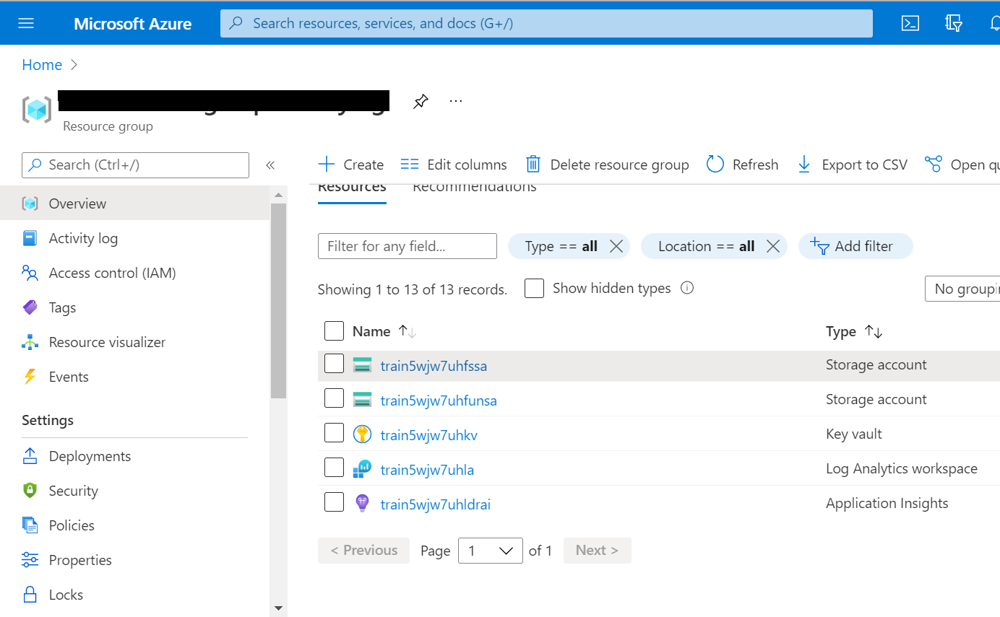
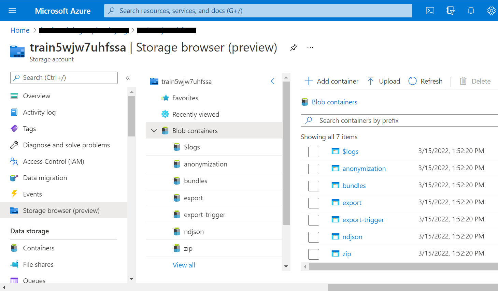
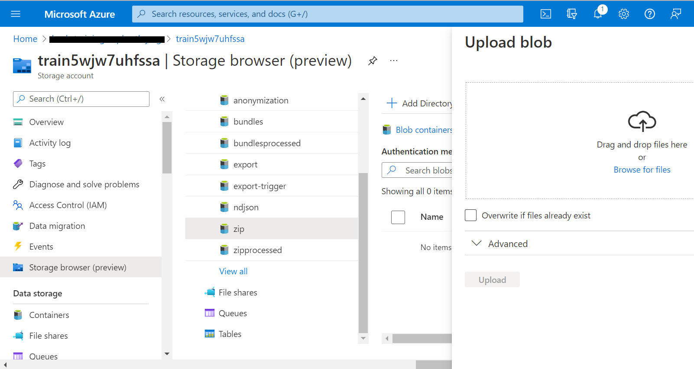
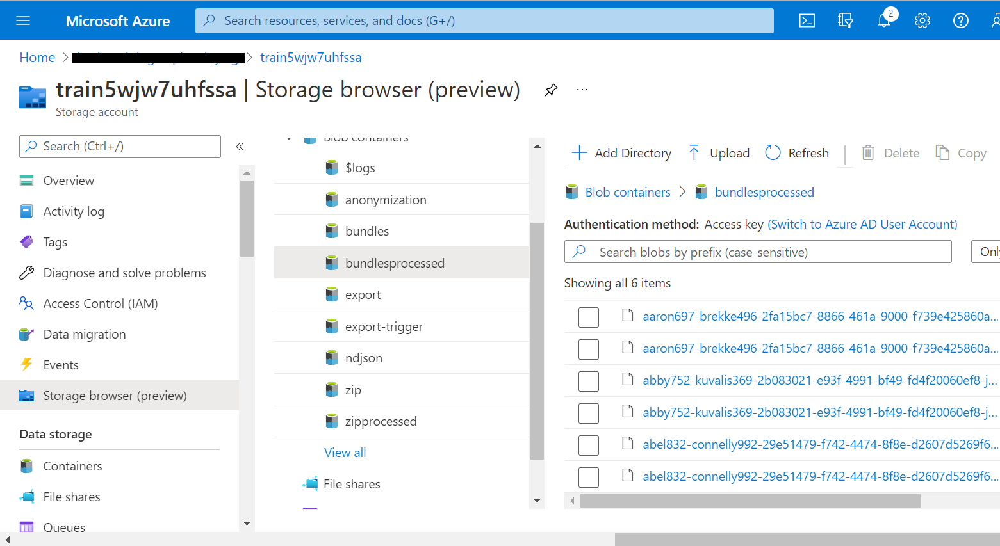

# Challenge-03 - Ingest to FHIR

## Introduction

Welcome to Challenge-03!

In this challenge, you will learn how to use the [FHIR-Bulk Loader](https://github.com/microsoft/fhir-loader) utility to bulk-ingest FHIR data into Azure API for FHIR.

## Background

Bulk FHIR data ingestion is a vital capability for managing FHIR data operations at scale. Since there is no official `$import` operation published in the FHIR standard (yet), implementors must rely on alternative methods of ingesting bulk data into a FHIR server. In this challenge, we will be using the FHIR-Bulk Loader (OSS) utility, which is an Azure Function App for importing bulk data into Azure API for FHIR. 

## Learning Objectives for Challenge-03

+ Bulk ingest FHIR data into Azure API for FHIR with FHIR-Bulk Loader
+ Identify issues in bulk FHIR data
+ Understand data constraints with bulk FHIR data loading
+ Understand how to track and compare bulk FHIR imports

### Azure API for FHIR and FHIR-Bulk Loader Relationship 
The open-source [FHIR-Bulk Loader](https://github.com/microsoft/fhir-loader) is an Azure component designed to ease the process of bulk data import into Azure API for FHIR. The operation simply requires the user to upload FHIR data files to Azure blob storage, and from there the FHIR-Bulk Loader automatically loads the data for persistence in Azure API for FHIR. The user may upload FHIR Bundles in regular JSON format (.zip compressed or non-compressed) or NDJSON format (non-compressed). Operationally, FHIR-Bulk Loader works by making parallel asynchronous API calls - either directly to an Azure API for FHIR endpoint or via FHIR-Proxy. In this challenge, we will be using FHIR-Bulk Loader directly connected to Azure API for FHIR (bypassing FHIR-Proxy).

Below is a component view of Azure API for FHIR with FHIR-Bulk Loader and FHIR-Proxy.  

## Prerequisites
+ Successful completion of Challenge-01
+ Postman installed
+ Access to a text editor (e.g., [VS Code](https://code.visualstudio.com/))

## Getting Started
For this challenge, you will upload FHIR data for import into Azure API for FHIR. You will need to examine some error logs and determine what is preventing a FHIR bundle from being ingested.

## Step 1 - Download Sample Data

Download the .zip files to your desktop (click the link and you will see a `download` button on the right): 
+ [good_bundles.zip](./samples/good_bundles.zip) 
+ [bad_bundles.zip](./samples/bad_bundles.zip) 

## Step 2 - Use FHIR-Bulk Loader to upload data

Visit the FHIR-Bulk Loader (OSS) repository [here](https://github.com/microsoft/fhir-loader) and read the documentation for more info on how the FHIR-Bulk Loader operates.

1. In Azure Portal, navigate to the Blob Storage account that was created for FHIR-Bulk Loader in Challenge-01. Go to **Portal -> Resource Group -> Storage account** (the name will end in "fssa").

2. In the Storage account, click on the **Storage browser (preview)** blade and then click on **Blob containers**. 

3. Click on the **zip** container and upload the `good_bundles.zip` file downloaded in Step 1 of this challenge.

 

+ Once you click **Upload**, the FHIR-Bulk Loader will automatically import the bulk data from the .zip file into the Azure API for FHIR database.

4. Now, when you do a refresh and click on **bundlesprocessed**, you should see six files as shown below.

_Note: If you upload a .zip file, the names of the bundles within the .zip file are exposed (not the .zip filename itself)._

 

## Step 3 - Debug issues with importing bulk FHIR data 

1. Try uploading the `bad_bundles.zip` file downloaded in Step 1 of this challenge to the same container where you uploaded the `good_bundles.zip` file.

2. What happens as a result?

> Refer to the Troubleshooting section below or the FHIR-Bulk Loader [testing](https://github.com/microsoft/fhir-loader/blob/main/docs/testing.md) documentation for information on tracking issues in bulk FHIR data ingestion. 

## Troubleshooting 
Here are some points for inspecting FHIR data ingestion results:

+ In **Storage browser (preview)**, go to **Container** -> **bundleserr** to view info about errors with FHIR bulk data files.  

     

+ Click on the **.response** file for the data that you want information about and then click on **Edit**.

     

    What is the reason given for the error?

+ In comparison, you can go to **bundlesprocessed** and look in the `.result` files for bulk ingest operations that succeeded. For example, in the image below there is a `201` status code, meaning success. The log shows an endpoint for a FHIR Resource `ExplanationOfBenefit/<resourceId>`, indicating that this Resource (`ExplanationOfBenefit/<resourceId>`) has been successfully persisted in Azure API for FHIR from the bulk ingest operation. 

    

## What does success look like for Challenge-03?

+ Successfully upload and import data from the file `good_bundles.zip`.
+ Successfully identify the problem in the `bad_bundles.zip` file. Use the Troubleshooting tips above for help. 
+ Identify **issues to address in production** to avoid problems when ingesting bulk FHIR data into Azure API for FHIR. 

## Next Steps

Click [here](<../Challenge-04 - Query and Search FHIR/Readme.md>) to proceed to Challenge-04.
