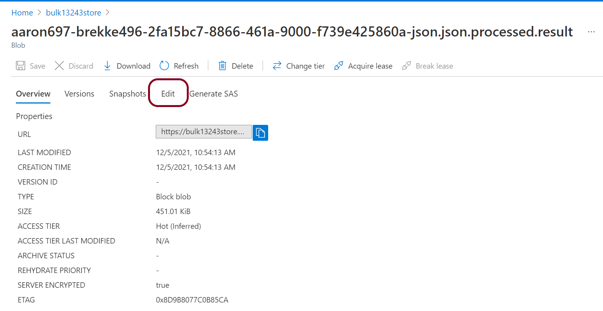

# Challenge-03 - Ingest to FHIR

## Introduction

Welcome to Challenge-03!

In this challenge, you will learn how to use the [FHIR-Bulk Loader](https://github.com/microsoft/fhir-loader) utility to bulk-ingest FHIR data into Azure API for FHIR.

## Background

Bulk FHIR data ingestion is a vital capability for managing FHIR data operations at scale. Since there is no official `$import` operation published in the FHIR standard (yet), implementors must rely on alternative methods of getting bulk FHIR data into a FHIR server. In this challenge, we will be using the FHIR-Bulk Loader (OSS) utility, which is an Azure Function App solution for importing bulk FHIR data into Azure API for FHIR. 

## Learning Objectives for Challenge-03

+ Bulk ingest FHIR data into Azure API for FHIR with FHIR-Bulk Loader
+ Identify issues in bulk FHIR data
+ Understand data constraints with bulk FHIR data loading
+ Understand how to track and compare bulk FHIR imports

### Azure API for FHIR, FHIR-Proxy, and FHIR-Bulk Loader Relationship 
The open-source [FHIR-Bulk Loader](https://github.com/microsoft/fhir-loader) tool is an Azure component designed to expedite bulk data import into Azure API for FHIR. The operation requires the user to upload FHIR data to Azure blob storage, from where FHIR-Bulk Loader automatically loads the data for persistence in Azure API for FHIR. FHIR-Bulk Loader works by making API calls to Azure API for FHIR - either directly or via FHIR-Proxy. The main use case for going through FHIR-Proxy is FHIR-Proxy's enhanced enforcement of authorization and consent. For the remainder of this challenge, we assume you are using FHIR-Bulk Loader connected directly to Azure API for FHIR (bypassing FHIR-Proxy).

Below is a component view of Azure API for FHIR with FHIR-Bulk Loader and FHIR-Proxy.  

## Prerequisites
+ Successful completion of Challenge-01
+ Postman installed
+ Access to a text editor (e.g., [VS Code](https://code.visualstudio.com/))

## Getting Started
For this challenge, you will upload FHIR data for import into Azure API for FHIR with FHIR-Bulk Loader. You will need to examine some of the data for problems and determine what is preventing the data from being ingested.

## Step 1 - Download Sample Data

Download the following .zip files to your desktop: 
+ [good_bundles.zip](./samples/good_bundles.zip) 
+ [bad_bundles.zip](./samples/bad_bundles.zip) 

## Step 2 - Read about FHIR-Bulk Loader operation

Visit the FHIR-Bulk Loader (OSS) repository [here](https://github.com/microsoft/fhir-loader) and read the documentation for instructions on how to upload bulk FHIR data into Azure API for FHIR (the process simply involves uploading files to a blob storage container in Azure).

**Keep in mind that you already deployed an instance of FHIR-Bulk Loader in Challenge-01.**

## Step 3 - Upload Sample Data

1. In Azure Portal, navigate to the FHIR-Bulk Loader Blob Storage resource that was created in Challenge-01.

2. Click on `Storage browser (preview)` and then click on `Blob container`.
  

3. Using the `good_bundles.zip` file downloaded in Step 1:
    + Determine which container this file should be uploaded to and proceed with the upload.

4. Using the `bad_bundles.zip` file downloaded in Step 1:
    + Try uploading the file to the same container where you uploaded the `good_bundles.zip`. What happens as a result?
    + Unzip the `bad_bundles.zip` and use a text editor to open the JSON file contained within. Look for the key piece of information that is preventing this bundle from being ingested.

> Refer to the Troubleshooting section below or the FHIR-Bulk Loader [testing](https://github.com/microsoft/fhir-loader/blob/main/docs/testing.md) documentation for information on common issues in bulk FHIR data ingestion. 

## Troubleshooting 
Here are some points for tracking down errors in FHIR data ingestion with FHIR-Bulk Loader.

Check Container bundlesprocessed and / or bundleserr for your file name.  

_Note: If you uploaded a .zip file, the names of the bundles within the .zip file are exposed (not the zip filename itself)._

Click on a **.result** file, then click on Edit

In the Editor view, look for status codes. Here a 201 is successful, and the logs show the FHIR Resource now containing the information. 

## What does success look like for Challenge-03?

+ Successfully upload and import data from the file `good_bundles.zip`.
+ Successfully identify the problem in the `bad_bundles.zip` file. Use the Troubleshooting tips above for help. 
+ Identify the **most important issue to address in production** to avoid problems when ingesting bulk FHIR data into Azure API for FHIR. 

## Next Steps

Click [here](../Challenge-04/Readme.md) to proceed to Challenge-04.
