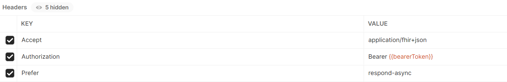

# Challenge-05 - Export and Anonymize Data
## Introduction

Welcome to Challenge-05!

In this challenge you will learn how to export anonymized data from Azure API for FHIR.

## Background

Healthcare organizations and payors frequently partner with outside research groups, and the data used in these research projects generally comes from patients' medical records. If the purpose of the research is academic and not for treatment, payment, or healthcare operations, researchers are not allowed to access patients' Personal Health Information (PHI) *unless* the information has been de-identified. De-identification of PHI involves removing details from patients' medical data that could reveal the patients' identities. In the U.S., de-identification (or anonymization) of PHI is regulated under the Health Insurance Portability and Accountability Act (HIPAA).

## Learning Objectives for Challenge-05
By the end of this challenge you will be able to
* Configure bulk export of FHIR data from Azure API for FHIR
* Use the sample anonymization config file to de-identify FHIR data on export
* Export anonymized data to an ADLS Gen2 account
* Share anonymized data with a group not affiliated with your organization

## Prerequisites 
* An Azure environment with a working instance of Azure API for FHIR. 
* FHIR data loaded into Azure API for FHIR. If the data you have loaded does not include Immunization or Patient Resources, go ahead and [load this bundle](https://github.com/kamoclav/openhack-mc4h-2/blob/main/Challenge-9/synthea_sample_data_fhir_r4%20OpenHack.zip) for a small dataset or check out [Synthea](https://synthetichealth.github.io/synthea/) for a larger dataset.
* Azure Data Lake Storage Gen2 deployed in your Azure environment.

## Step 1: Review sample anonymization configuration and customize if needed
Microsoft provides a sample configuration file to anonymize data according to HIPAA Safe Harbor specifications. It's important to review the sample configuration and the HIPAA Safe Harbor rules to determine if the sample configuration will work for your organization. If the sample configuration doesn't meet your organization's requirements for PHI de-identification, you will need to implement your own anonymization rules in the configuration file.

More information on HIPAA de-identification rules can be found [here](https://www.hhs.gov/hipaa/for-professionals/privacy/special-topics/de-identification/index.html).

**Task:**  
Configure your Azure API for FHIR for export to a storage account following the instructions [here](https://docs.microsoft.com/en-us/azure/healthcare-apis/data-transformation/configure-export-data).  

Note: You are enabling a managed identity on the Azure API for FHIR resource. That managed identity is what needs to be added to the storage account with Storage Blob Data Contributor privledges. Be careful not to add the service client or a service principle by mistake.  

For more information on the sample anonymization file, check out [de-identified-export-operation-on-the-fhir-server](https://github.com/microsoft/Tools-for-Health-Data-Anonymization/blob/master/docs/FHIR-anonymization.md#how-to-perform-de-identified-export-operation-on-the-fhir-server).

For a general overview of the $export operation's query parameters for de-identification, check out [this documentation](https://docs.microsoft.com/en-us/azure/healthcare-apis/data-transformation/de-identified-export).

## Step 2: Export anonymized data to a storage account

**Task:**  
Perform a de-identified $export on Azure API for FHIR. If you get stuck, refer to the documentation in Step 1.  

The general format of the query will be  
`https://<<FHIR service base URL>>/$export?_container=<<container_name>>&_anonymizationConfig=<<config file name>>&_anonymizationConfigEtag=<<ETag on storage>>`

The $export operation has required headers 
* Accept: application/fhir+json
* Authorization: Bearer{{bearerToken}}
* Prefer: respond-async.  

  

For more information on headers check out this [documentation] (https://hl7.org/Fhir/uv/bulkdata/export/index.html#headers)

## Step 3: Securely transfer the file to the research team
Researchers from outside organizations cannot have direct access to Healthcare or Payor organizations' Azure tennants. You will need to set up a way to securely transfer the anonymized datasets to these external groups.

**Task:**  
Set up a shared access signature (SAS) token to allow a research team to access the anonymized datasets that you exported.

If you get stuck, check out [Create SAS Tokens](https://docs.microsoft.com/en-us/azure/cognitive-services/translator/document-translation/create-sas-tokens?tabs=Containers).

## Challenge Success

+ Successfully utilize an anonymization configuration file and the $export operator to export an anonymized dataset from Azure API for FHIR
+ Successfully set up a SAS token to allow access to the anonymized dataset

## Next Steps

Click [here](../Challenge-06/ReadMe.md) to proceed to the next challenge.
