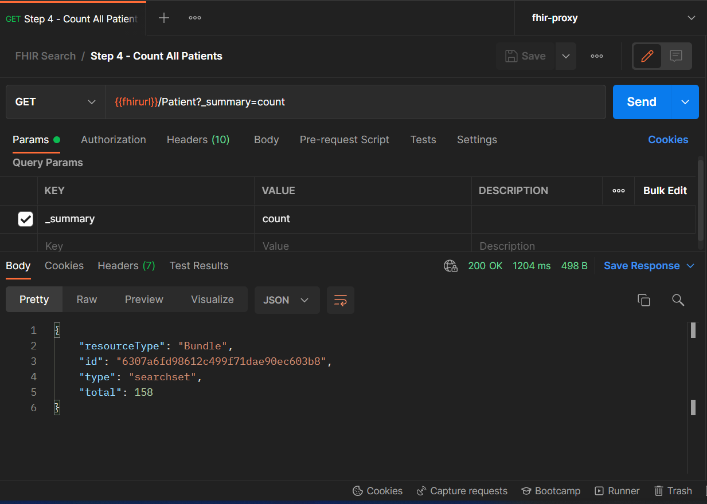
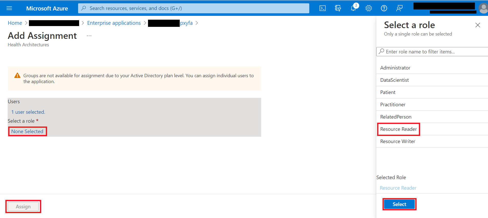
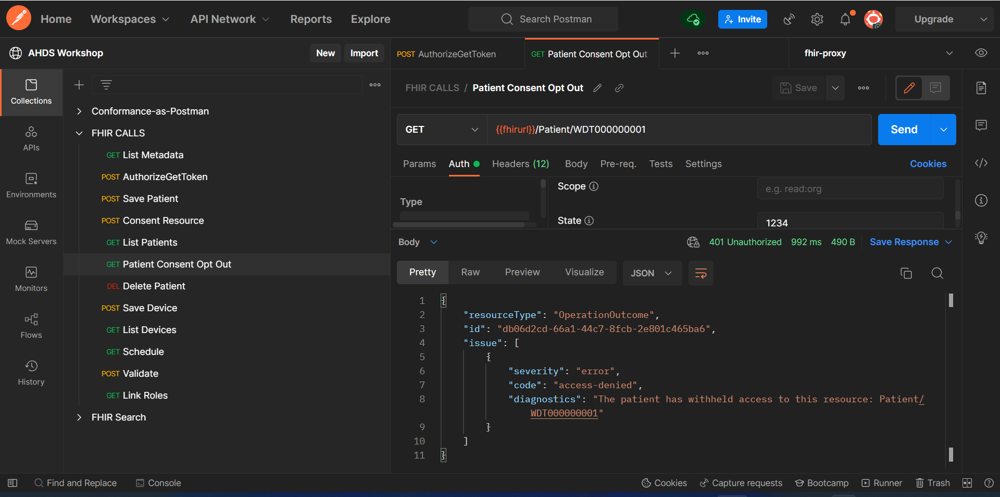

# Challenge-07 - FHIR service consent capabilities

## Introduction

Welcome to Challenge-07!

In this challenge, you will use [FHIR-Proxy](https://github.com/microsoft/fhir-proxy) (OSS) to block access to data stored in the [FHIR service](https://docs.microsoft.com/en-us/azure/healthcare-apis/fhir/overview).

## Background

The wide adoption of [FHIR R4](https://hl7.org/FHIR/) has given patients a new measure of control over their health data. With a patient's data stored in FHIR, mechanisms are available to block certain providers and/or organizations from accessing the data if the patient elects to withhold records. One way these data restrictions are managed in FHIR is through the [Consent Resource](https://build.fhir.org/consent.html). In this challenge, we will be exploring capabilities in the Azure health data platform that make it possible for patients to opt out of sharing their FHIR records with certain parties.

## Learning Objectives for Challenge-07
By the end of this challenge you will be able to 

+ configure FHIR-Proxy authentication for connecting to the FHIR service
+ configure Postman to connect with the FHIR service via FHIR-Proxy
+ add a `Consent` Resource to the FHIR service
+ configure Consent Opt-Out filtering in FHIR-Proxy
+ verify that Consent Opt-Out filtering performs as expected

## Prerequisites

+ Azure Health Data Services FHIR service deployed (completed in Challenge-01)
+ FHIR-Proxy deployed (completed in Challenge-01)
+ Postman installed and registered in AAD (completed in Challenge-01)
+ Patient data in your FHIR service (completed in Challenge-04, Step 1)

## Getting Started 
In this challenge, you will be activating the [Consent Opt-Out filter](https://github.com/microsoft/fhir-proxy/blob/main/docs/configuration.md#consent-opt-out-filter) in [FHIR-Proxy](https://github.com/microsoft/fhir-proxy) (OSS). You will be modifying authorization settings to block a specific practitioner from accessing a patient's FHIR records in the FHIR service. For configuring and testing the Consent Opt-Out filter, you will be setting up Postman to call the FHIR-Proxy endpoint.

### FHIR-Proxy and FHIR service overview
In the Azure health data platform, FHIR-Proxy (OSS) acts as a gateway for API calls to the FHIR service. FHIR-Proxy enables pre-processing of API requests and post-processing of responses, selectively filtering data on the way into and out of the FHIR service. As an example, you can set up FHIR-Proxy to intercept FHIR API calls and trigger custom workflows based on detected FHIR requests. FHIR-Proxy also brings enhanced Role Based Access Control (RBAC) to the FHIR service, enabling fine-grained Azure AD authorization for REST API actions at the Resource level. This also provides a means of Role-Based Consent so that users (e.g. patients) can authorize or deny access to certain FHIR data.

Component View of FHIR-Proxy and FHIR service with Postman set up to call the FHIR-Proxy endpoint.


FHIR-Proxy asserts control over FHIR data interactions only if its [pre- and/or post-processing modules](https://github.com/microsoft/fhir-proxy/blob/main/docs/configuration.md#date-sort-post-processor) have been enabled and configured. Otherwise, with no special configuration, API calls made to the FHIR-Proxy endpoint go straight through to the FHIR service, and responses are sent back unfiltered to the remote client app (such as Postman in our case). 

In Challenge-01, you enabled the Consent Opt-Out filter when you deployed FHIR-Proxy. Now you'll need to do some configuration for the filter to take effect.

## Step 1 - Configure FHIR-Proxy authentication settings
Before setting up FHIR-Proxy for Consent Opt-Out filtering, you must first configure FHIR-Proxy authentication so that FHIR-Proxy can securely connect with the FHIR service.

To begin, **CTRL+click** (Windows or Linux) or **CMD+click** (Mac) on the link below to open the FHIR-Proxy authentication setup instructions in a new browser tab. When you go to the page, follow the instructions in Step 2 and Step 3 (you already completed the instructions in Step 1 when you deployed components in Challenge-01). Please return here when finished. 

[FHIR-Proxy Authentication Setup Instructions](../resources/docs/FHIR-Starter_ARM_template_README.md#step-2---complete-fhir-proxy-authentication)

## Step 2 - Configure Postman to connect with the FHIR-Proxy endpoint
In the next part of this challenge, you will be setting up a new environment in Postman so that API calls go to the FHIR-Proxy endpoint rather than directly to the FHIR service endpoint.

To begin, **CTRL+click** (Windows or Linux) or **CMD+click** (Mac) on the link below to open the Postman setup instructions for FHIR-Proxy in a new browser tab. Follow the instructions and return here when finished.

[Postman Tutorial for FHIR-Proxy](../resources/docs/Postman_FHIR-Proxy_README.md)

## Step 3 - Confirm Postman configuration

1. Be sure that `fhir-proxy` is selected as your active environment in Postman (upper right-hand corner). 

2. Check that you can access `Patient` Resources on the FHIR service with Postman connected to the FHIR-Proxy endpoint. Try running the `Count All Patients` request in your FHIR Search collection in Postman.

```
GET {{fhirurl}}/Patient?_summary=count
```

You should receive a `Bundle` as shown below (the number of patients will be different from what is shown in the image). 

 

To confirm you have the `Patient` and `Practitioner` Resources needed for this challenge, send the following requests in Postman:

`GET {{fhirurl}}/Patient/WDT000000001`

`GET {{fhirurl}}/Practitioner/WDT000000003`

You should receive a `200 OK` response code for each of these requests. If not, you will need to run the `POST Save Sample Resources` request again in the FHIR Search collection in Postman (this step was covered in Challenge-04).

## Step 4 - Post a Consent Resource to the FHIR service
Here you will populate your FHIR service with a [Consent Resource](https://www.hl7.org/fhir/consent.html) to configure the [Consent Opt-Out filter](https://github.com/microsoft/fhir-proxy/blob/main/docs/configuration.md#consent-opt-out-filter) in FHIR-Proxy.

1. Review the sample `Consent` Resource in the `consent-resource.json` file located [here](./sample-data/consent-resource.json). You will see that `Patient/WDT000000001` is opting out of sharing records with `Practitioner/WDT000000003`.
2. Go to the FHIR CALLS collection in Postman and click on the `POST Consent Resource` call.
3. Inspect the **Body** of the request, and you will see that it contains the same `Consent` Resource that you just reviewed above.
4. Click **Send** to populate your FHIR service with the `Consent` Resource.

## Step 5 - Add a Practitioner role in FHIR-Proxy
 To configure Consent Opt-Out, you must create a [FHIR Participant](http://hl7.org/fhir/2020Feb/participant.html) role for the individual (or organization) being blocked from access to a patient's FHIR data. In the real world, you would be associating a FHIR Participant role with a provider, and you would be activating the `Consent` Resource on behalf of a patient to block said provider from accessing the patient's FHIR records. In this exercise, you are going to be assigning a FHIR Participant role to *your own Azure account* – as though you are the provider (i.e., `Practitioner/WDT000000003`) being blocked from accessing FHIR data owned by `Patient/WDT000000001`. 
 
 Review [this information](https://github.com/microsoft/fhir-proxy/blob/main/docs/configuration.md#configuring-participant-authorization-roles-for-users) about configuring FHIR Participant roles for FHIR-Proxy and then return here when finished.

1. Go to **Portal** -> **AAD** -> **Enterprise Applications** -> `<fhir_proxy_app_name>` -> **Users and groups**.

2. Click on **+Add user/group**.

3. Under **Users** click **None Selected**. Type in your name or Azure login name and press **Select**.

4. Under **Select a role**, click **None Selected**. Click **Resource Reader**, and then click **Select** and **Assign**.



5. Click on **+Add user/group** (again).

6. Under **Users** click **None Selected** (again). Type in your name or Azure login name and press **Select** (again).

7. Under **Select a role**, click **None Selected** (again). Click **Practitioner**, and then click **Select** and **Assign**.


You have now assigned the Practitioner role to yourself in FHIR-Proxy. This prepares FHIR-Proxy to associate your identity in AAD with a `Practitioner` Resource in the FHIR service. In the next step, you will use FHIR-Proxy to make a direct link between your user account and `Practitioner/WDT000000003`.

## Step 6 - Link your Object ID to a FHIR Practitioner Resource ID
Now you will be linking the `Practitioner/WDT000000003` Resource to your user account's **Object ID** in AAD. This will cause the Consent Opt-Out filter in FHIR-Proxy to listen for API calls from *you* and enforce the `Consent` rules blocking `Practitioner/WDT000000003` (you) from accessing data belonging to `Patient/WDT000000001`. See the FHIR-Proxy configuration [documentation](https://github.com/microsoft/fhir-proxy/blob/main/docs/configuration.md#linking-users-in-participant-roles-to-fhir-resources) for details on the linkage between a [User Principal](https://docs.microsoft.com/en-us/azure/active-directory/develop/app-objects-and-service-principals#service-principal-object) in AAD and a Resource instance in the FHIR service. 

1. Go to **Portal** -> **AAD** -> **Users**.
2. Do a search for yourself and click on your name in the list.
3. In the **Profile** blade, copy the **Object ID** for your account.
4. You will also need your `<fhir_proxy_app_name>` (**Portal** -> **Resource Group** -> `<fhir_proxy_app_name>`).
5. In Postman, get a new access token (`POST AuthorizeGetToken`).
6. Then go to the FHIR CALLS collection and click on the `GET Link Roles` call.
7. In the URL field for the request, you will see this string:
    - `https://<fhir_proxy_app_name>.azurewebsites.net/manage/link/Practitioner/WDT000000003/<object-id>`
8. Paste your `<fhir_proxy_app_name>` and `<object-id>` in the appropriate places in the string.
9. Press **Send**. You will get back a message saying the link has been established with a response code of `200`.

## Step 7 Authenticate yourself using auth code flow in Postman
You now need to authenticate yourself as the caller trying to access `Patient/WDT000000001`. This way, FHIR-Proxy will know to block your access to `Patient/WDT000000001` – because your Azure account is associated with `Practitioner/WDT000000003`.

1. Go to the FHIR CALLS collection in Postman and click on the `GET Patient Consent Opt Out` call.
2. Click on the **Authorization** tab.
3. Scroll down and click **Get New Access Token**.
4. You will be prompted to "Authenticate via browser". Click **Proceed**.
5. You will be taken to a new tab in your web browser, and if you are already logged into Azure Portal in your browser session, you should see a message: "Your call is authenticated". 
    - If you are not logged into Azure Portal, you will be prompted to authenticate with your Azure login credentials. 
    - **Important**: Make sure to disable pop-up window blocking for the Postman auth code page in your browser.
6. After authenticating in your browser, you'll return to Postman and you'll see "Authentication complete". Click **Proceed**.
7. Then click **Use Token** in the **MANAGE ACCESS TOKENS** window in Postman.

> Note: To check that your Azure user account is correctly linked to the `Practitioner` role, copy the new **Access Token** from the **MANAGE ACCESS TOKENS** window and paste it into the JSON Web Token viewer at https://jwt.io/. Under `"roles"`, you should see the `"Writer"`, `"Practitioner"`, and `"Reader"` roles for yourself.

## Step 8 - Confirm Consent Opt-Out is working
Now, if you press **Send** in the `GET Patient Consent Opt Out` call, you should receive an `"access-denied"` response with a `401 Unauthorized` code as shown below. This indicates that Consent Opt-Out is working properly.
 

## What does success look like for Challenge-07?

+ Successfully `POST` a `Consent` Resource to the FHIR service.
+ Verify that Consent Opt-Out properly filters a `Patient` Resource.

## Next Steps

Click [here](<../Challenge-08 - DICOM service/Readme.md>) to proceed to the next challenge.
