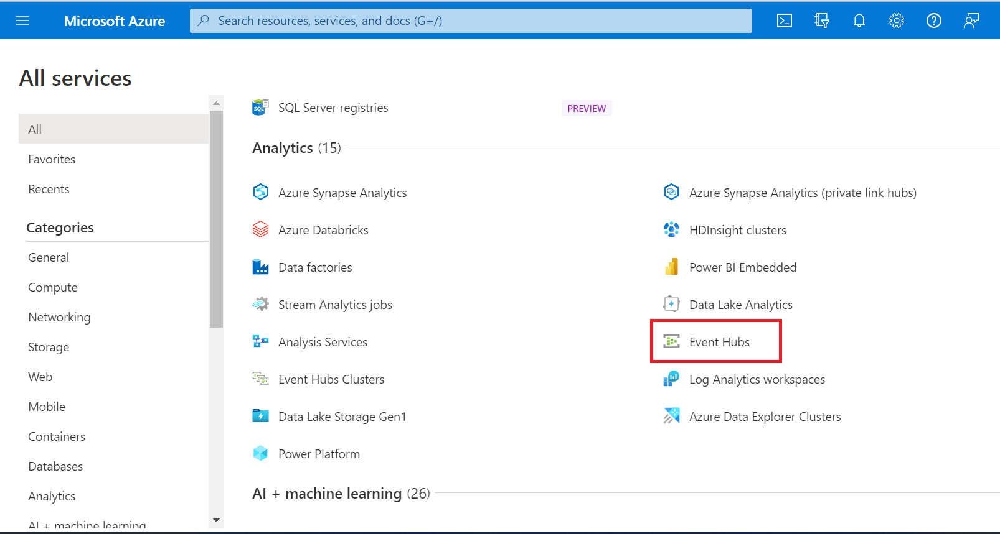
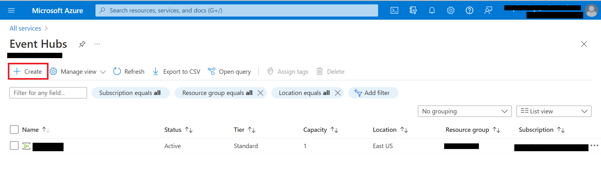
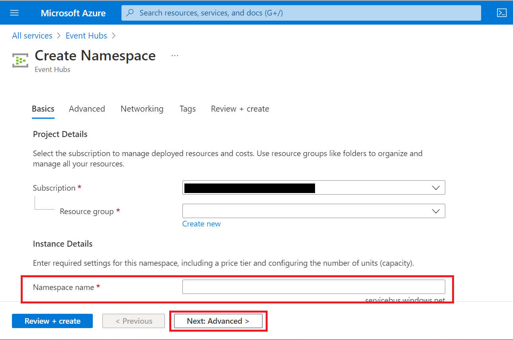
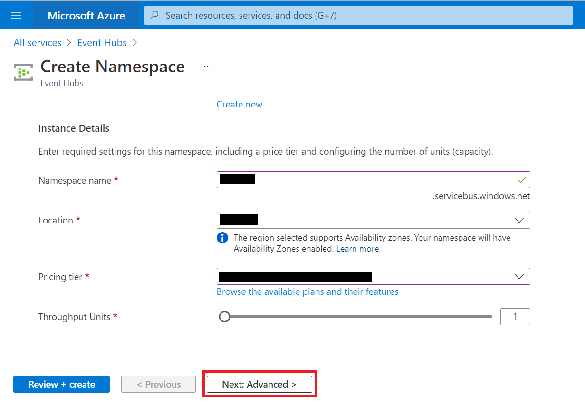

# Challenge-09 - MedTech service

## Introduction

Welcome to Challenge-09!

In this challenge, you will get experience working with medical IoT data using the [MedTech service](https://docs.microsoft.com/en-us/azure/healthcare-apis/iot/iot-connector-overview) in Azure Health Data Services.

## Background

With the rise of wearables and other connected sensor technologies, IoT devices have exploded in the healthcare marketplace. Currently, there is no single data standard for medical IoT device I/O, and this has resulted in many proprietary data models in use across the medical IoT landscape. To provide a centralized platform for medical IoT data connectivity, Microsoft has taken a vendor-agnostic approach, offering the MedTech service toolkit for converting output from any medical IoT device into FHIR. In this challenge, we will be using the MedTech service in Azure Health Data Services to map medical IoT data for ingestion into the FHIR service.

## Learning Objectives for Challenge-09
By the end of this challenge you will be able to

- deploy and configure the MedTech service via Azure portal
- deploy and configure additional Azure services required for the MedTech service
- connect the MedTech service to FHIR service
- import a data mapping file for transforming incoming device data into FHIR
- inspect medical IoT data flow

## Prerequisites 
+ Azure Health Data Services workspace deployed (completed in Challenge-01)
+ FHIR service deployed (completed in Challenge-01) 

## Getting Started 
In this challenge, you will be deploying MedTech service within your Azure Health Data Services workspace, and you will be configuring the service to receive and transform medical IoT data for persistence in FHIR. The steps in this challenge are outlined below.

**Step 1** - Deploy and configure [Azure Event Hubs](https://docs.microsoft.com/en-us/azure/event-hubs/event-hubs-about).  
**Step 2** - Deploy a MedTech service instance in your Azure Health Data Services workspace.  
**Step 3** - Import data mappings for converting medical IoT device data into FHIR.  
**Step 4** - Configure Azure Roles for MedTech service to securely connect to the FHIR service.  
**Step 5** - Install tools for creating custom IoT data mappings for storing IoT data in FHIR.  
**Step 6** - Import custom IoT data maps into MedTech service.

Have a look at [this document](https://docs.microsoft.com/en-us/azure/healthcare-apis/iot/get-started-with-iot) for an overview of the MedTech service deployment and configuration process (you already deployed an Azure Health Data Services workspace and FHIR service in Challenge-01).

## Step 1 - Deploy and configure Azure Event Hubs
In the first part of this challenge, you will use the Azure Portal to create an Event Hubs namespace and your own Event Hub.

1. Go to **Portal** -> **Create a resource** and then click on **See more in All services**.

2. Scroll down to **Analytics** (or click on **Analytics** on the left).

3. Select **Event Hubs**.

4. Click on **+Create**.

5. Enter a unique name in the **Namespace name** field. Then click **Next: Advanced >**.

6. Confirm that the **Namespace name**, **Location**, and **Pricing tier** are correct. Then click **Next: Advanced >**.

7. Confirm that your **Advanced** settings are correct and click **Next: Networking >**.

8. Confirm that your **Networking** settings are correct and click **Next: Tags >**.

9. Add any tags as needed and click **Next: Review + create >**.

10. Click **Create**.

11. Go to [Create an Event Hub](https://docs.microsoft.com/en-us/azure/event-hubs/event-hubs-create#create-an-event-hub) in a new browser tab and follow the instructions to complete setting up your new Event Hub. Return here when finished.

## Step 2 - Deploy MedTech service in your Azure Health Data Services workspace 
Now you will use Azure Portal to deploy and configure MedTech service within your Azure Health Data Services workspace.

1. Open the instructions to [Deploy MedTech service in the Azure Portal](https://docs.microsoft.com/en-us/azure/healthcare-apis/iot/deploy-iot-connector-in-azure#deploy-the-medtech-service-manually) in a new browser tab. 

2. When you get to the part of the instructions to [Configure MedTech service to ingest data](https://docs.microsoft.com/en-us/azure/healthcare-apis/iot/deploy-iot-connector-in-azure#configure-medtech-service-to-ingest-data), for this training it is recommended to use the default [Consumer group](https://docs.microsoft.com/en-us/azure/event-hubs/event-hubs-features#consumer-groups) that was assigned when you created your Event Hub in the previous step. 

## Step 3 - Import data mappings for converting medical IoT device data into FHIR

In the [Configure Device mapping properties](https://docs.microsoft.com/en-us/azure/healthcare-apis/iot/deploy-iot-connector-in-azure#configure-device-mapping-properties) section, you will be going to [another GitHub repository](https://github.com/microsoft/iomt-fhir/blob/main/docs/Configuration.md#device-content-mapping) and copying two sample data mapping templates to paste directly into MedTech service in Azure portal. You will paste one of the templates in the MedTech service **Device Mapping** tab and another in the MedTech service **Destination** tab. Read the instructions both [here](https://docs.microsoft.com/en-us/azure/healthcare-apis/iot/deploy-iot-connector-in-azure#configure-device-mapping-properties) and [here](https://github.com/microsoft/iomt-fhir/blob/main/docs/Configuration.md#device-content-mapping) and then go [here](https://github.com/microsoft/azure-health-data-services-workshop/tree/main/Challenge-09%20-%20MedTech%20service/SampleData/Answers) to copy the two sample templates. 

**Note:** The instructions in the GitHub repository linked above are written for the IoMT FHIR Connector for Azure (OSS), but the same principles apply to MedTech service.

## Step 4 - Configure Azure roles for MedTech service access

Now you will configure permissions so that MedTech service can securely connect with FHIR service and the Event Hub that you deployed in Step 1 of this challenge. Continue with [the instructions for granting access](https://docs.microsoft.com/en-us/azure/healthcare-apis/iot/deploy-iot-connector-in-azure#granting-medtech-service-access) through to the end of the page and then return here when finished.

__Note:__ When creating a new mapping, you must click the 'Confirm' button. Pressing ENTER after typing will not work.

## Step 5 - BONUS

Use this [IoT mapper tool](https://github.com/microsoft/iomt-fhir/tree/main/tools/data-mapper) to create maps for the sample messages in the `SampleData` folder for this challenge (accessible at the top of the page). You will find that the `SampleData` folder has two files. Both files are the same data, but the `Three-Sample-Message-Types-with-labels.json` has messages with data descriptions and/or units of measure. There are three sample messages in each file - `VITALS`, `BP`, and `WEIGHT`. The `VITALS` message is an array of data. `BP` and `WEIGHT` are single-entry messages. 

When you begin the FHIR mapping, you can make up values for the 'Code'. For example - `Code: A1235, System: https://loinc.org, Text: Heart Rate`.

## Step 6 -BONUS

Import your newly created sample mappings into the MedTech service via the Azure Portal. You can follow the same process in Step 3 of this challenge to import your custom mappings into MedTech service.

## What does success look like for Challenge-09?
+ Configure MedTech service for mapping medical IoT device data to FHIR.
+ Generate a custom mapping for medical IoT device data into FHIR.

## Next Steps

Click [here](<../Challenge-10 - Optional - FhirBlaze (Blazor app dev + FHIR)/ReadMe.md>) to proceed to the next challenge.
