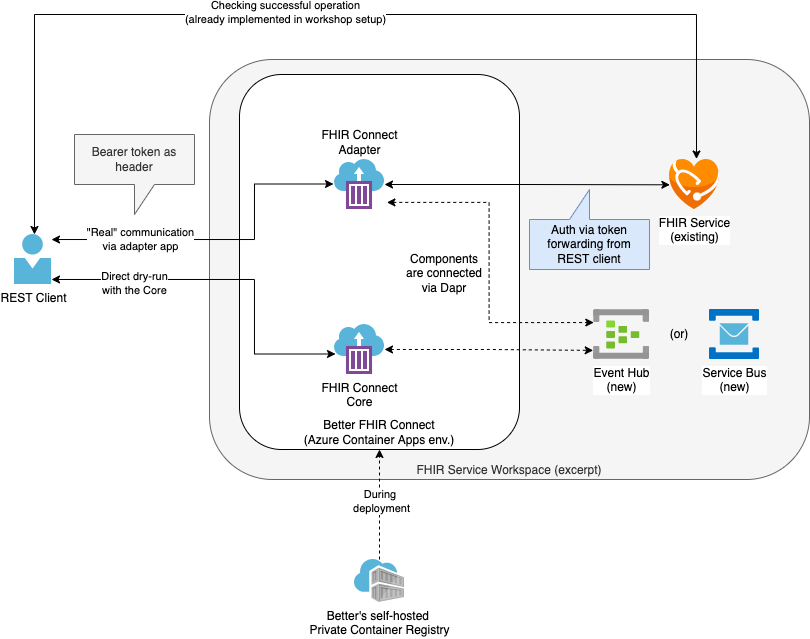

# Challenge-XY - Convert between openEHR and FHIR with Better's FHIR Connect

## Introduction

In this challenge, you will learn to use [Better's](https://better.care) converter tool **FHIR Connect** to convert from openEHR to FHIR and vice versa. [1]

## Background

Next to standards and data formats like *FHIR*, *openEHR* is common in Europe.
*FHIR* and *openEHR* have many similarities at first, but looking deeper into it shows differences.
Without going into detailed comparison, recent projects and developments have shown several use-cases can benefit the most from combining *FHIR* and *openEHR* (see [2] for more details).
Doing that requires the ability to convert data from one format into the other, and vice versa.

### openEHR

As the other modules were covering *FHIR* already, the following introduction into *openEHR* will help to get a general overview for newcomers.

From a bird's eye view, *openEHR* is essentially a framework, a set of specifications on how to build components of open and interoperable healthcare IT systems. 

The *two layered architecture* is one of *openEHR's* core principles. It describes the separation of *data representation* and *domain content*. 

**Data representation**: *openEHR* doesn't provide users and developers with a set of data types or classes, which represent clinical concepts.
The specification instead provides basic building block types, much like primitive data types in programming languages.
This means there's a common understanding of concepts like texts, numbers, scales and so on. Other details, like how data instances might be linked, organized and much more is also defined as a common ground.

The separated data layer also allows to create applications with complete independency of the clinical models itself (see below).  
Models are only processed at run-time, resulting in built-once run-everything applications.

**Clinical domain content**: Conceptually speaking, the actual domain (the clinical world) is not touching the data layer.
The clinical modeling is the process of assembling representations of clinical concepts from the basic data types provided by the specification.
The modeling results in two different artifacts.
One is, the general reusable concept, called **Archetype**.
The other one is the use-case specific composition of such building block concepts, called **Template**.

> Illustration: 
> 1. Imagine how small basic Lego pieces (lowest level technical specification types) 
> 2. are used to assemble functional building block of real world objects (for instance, in the context of cars: door, hood, engine, tires),
> 3. which in turn are used to compose the actual object (here, the car itself).

To ensure a high level of data-richness and the reusability of the *Archetypes* they are build with the *maximum modeling paradigm* in mind. This entitles to represent concepts with the highest possible coverage of clinical use-cases possible.
For instance, the blood pressure *Archetype* was created by clinical experts in a way it covers simpler use-cases (like a GP observation) as well as the most complex ones (cardiology specialists).

Most of the *openEHR* modeling work happens in either the [international modeling community](http://ckm.openehr.org/) or in open, yet separated, nation/region/project-specific communities.

**Summary**: *openEHR* offers a set of specifications to build robust and open healthcare IT systems/components.

If you want to learn more on openEHR check the technical resources [3] or read more on the highlights from a user's/organization's perspective [4].

## Further Content and Sources

- [1] https://news.better.care/introducing-fhir-connect
- [2] https://medium.com/@alastairallen/fhir-openehr-2022-53716f837340
- [3] https://www.openehr.org/about/what_is_openehr or in more technical detail: https://specifications.openehr.org/releases/BASE/latest/architecture_overview.html
- [4] https://medium.com/@alastairallen/why-openehr-is-eating-healthcare-e28bd792c50c

## Learning Objectives

By the end of this challenge you will be able to

- make use of your basic knowledge of openEHR and learn more about with the given resources
- explain the general idea of Better's FHIR Connect tooling
- deploy mappings to the FHIR Connect Core
- directly convert openEHR data to FHIR data and vice versa
- utilize *adapter* apps on top of the FHIR Connect Core, here to commit openEHR data as FHIR to the Azure FHIR service
- write and alter mappings yourself

## Prerequisites

... **TODO** basically the same Postman setup like the rest of the workshop uses, but either add steps here to add `core_server` and `adapter_server` values in the Postman environment OR add that directly to the original setup in the general Postman setup tutorial.

---

## Step 1 - Learn the basics

To convert between *FHIR* and *openEHR* it is important to understand both the similarities and differences. One important property of both formats is the variability.
*FHIR* can utilize a broad set of pre-defined definitions and structures to represent any clinical data point.
For instance, the Observation resource type can represent virtually any codable LOINC laboratory result.
On the other hand, *openEHR* can leverage international (or custom) *Archetypes* to compose use-case matching *Templates* in a so called *two-layered modelling architecture*.
Together, there's just too much variety to on both sides to be able to build an automatic converter. Instead, we express converting rules in mapping files. Ideally they are (co-)authored by clinical experts.

The *FHIR* Connect mappings are divided in Model and Context mappings:

**Model Mappings** are attached to the lower level of the modeling process. They connect two universally matching data points.
For instance, a *FHIR* Observation resource matching a systolic blood pressure reading AND its matching *openEHR* blood pressure Archetype.
Due to the maximum modeling paradigm of *openEHR* the matching *openEHR* Archetype covers more data points in almost any case.
This results in Model Mappings being bound to one of the many available specific *openEHR* Archetypes, while on the other side having one of the *FHIR* general purpose Resource type abstractions (Observation, Medication, …).

Example : A *FHIR* Observation with a LOINC code for a systolic blood pressure has its value and unit data point mapped over to the value and magnitude data points in the matching *openEHR* Archetype.

> Note: Model mappings are meant to universally reusable. This allows us to create an open global community, to share such mappings in the near future.

**Context Mappings** represent the higher level modeling layer. Simply put they compose the use-cases from Model Mappings. On the *FHIR* side that means a Bundle consisting a set of somewhat contextual resources in most cases. For *openEHR* a Template is the matching concept.

Example: An *openEHR* growth-chart *Template*, consisting of *Archetypes* for height, weight, BMI and head circumference will utilize the Model Mappings of those *Archetypes*, when processing the conversation to and from FHIR.

### Architecture overview

<!-- TODO: why is the image quality not sharp? -->
<!-- TODO: technically wrong icon. is there really no icon for 'Azure Container Apps' in the open resources? -->

In the following introductory steps you will interact with the Core component, as illustrated in the diagram.
In practice, direct communication between a client and the Core is not the usual use-case.
Usually, an adapter app will be put on top of the Core to handle the project specific requirements and demographics. Here we interact with the Core for educational purposes.

### Tasks

Interacting with the *FHIR* Connect Core component and running your first translation:

1. Go to Postman and open the `01 - Connect Core` collection.
2. Run the `Provision initial mappings` folder (-> to run a folder as set, click `…` on the right of it and select `Run folder`. In the following "Runner" window click `Run 01 - Connect Core` to run all the requests in sequence.)
3. Check that all requests returned a `200 OK` (see right hand side). (Note: if you get a `400`, it is likely that you committed the mappings multiple times and the Core doesn't want to override the existing one.)
4. Now send the following `01 - Directly translate openEHR content` request to invoke the first direct translation from *openEHR* to *FHIR*.
5. Check the result: A Bundle containing four Resources

Background on the input and output: The *openEHR* data from the input is data from a pediatric growth-chart, covering a set of measurements at one point in time. In *openEHR* this is composed from over four different Archetypes into this use-case specific growth-chart Template. 
On the *FHIR* side this results in a Bundle with the matching Resources, for each *openEHR* Archetype and existing Model Mapping.

6. Finally, also run the `02 - Directly translate FHIR content` request, to see the same set of mappings also translate *FHIR* back to *openEHR*.
	
> Note: All output from the Core - as a component which is not usually directly interacted with - is the "raw" translation engine output.
This means, submitting this output to a *FHIR* or *openEHR* server works, but in some cases it makes sense to supplement the payload with additional data on the Adapter level.

## Step 2 - Adapter

As illustrated above, the *FHIR* Connect Core shall be wrapped and utilized by an Adapter app. In this example a simple *FHIR* forwarder Adapter is used to demonstrate pushing *openEHR* data into a *FHIR* repository.

> Note: To keep this module's content focused on the *FHIR* Connect key concepts the Adapter used here will lack any handling of demographics.
> For instance, project specific implementations might want to resolve the *openEHR* subject ID with an external demographics server to get the matching *FHIR* patient ID.
> The resulting *FHIR* Resources will have limited real world use, without linking them to patients.

### Tasks

1. Open the `02 - Adapter - FHIR Forwarder` collection in Postman
2. Run the `00 - Get Auth Token` request, to be able to talk to the *FHIR* Service (**TODO**: see Challenge 04? for more info)
3. Now send the request `01 - Commit openEHR input` and note the target: the Adapter application.
Under the hood, this will utilize the manual steps we executed above to translate the given *openEHR* data to *FHIR*. The *FHIR* Forwarder Adapter app will also use that token and commit the results of the translation to the *FHIR* service itself.
4. Due to the async nature of how the components interact the response of the previous request can't cover the actual result of the *FHIR* service committing. 
To get better insight, the `02 - Get logs` request gets a list of log entries. This should now includes four entries, which were successfully being created in the *FHIR* service.
5. Copy on of the UUIDs from the logs and paste it in the `03 - Get FHIR Resource` request's path. (Format: `{{FHIR_service}}/Observation/YOUR_UUID`)
6. Run the request with the custom UUID and get one of the four matching Resources back, directly from the *FHIR service*.

## Step 3 - Alter Mapping

We now have covered all components and the basic usage of each. Let's use that new knowledge to go a bit further: In this step we will start with a rather simple blood pressure mapping.

1. In the Postman collection `03 - Alter Mapping`, have a look at the body of the first request. 

> Hint: Unfortunately, Postman doesn't have YAML highlighting, making it hard to read the body. Copy the YAML mapping into your favorite editor or use an online tool like https://jsonformatter.org/yaml-formatter for easier reading.

2. Get familiar with this Model Mapping on a fundamental level. Identify the one high level clinical data point, which is addressed in this mapping.

> Hint: The most important and core data points of a blood pressure measurements are systolic and diastolic pressure values.

3. Prepare the *FHIR Connect Core* with this Model Mapping and its Context Mapping by sending the first two requests.
4. Have a look at the payload of the `03 - Core - Directly translate FHIR content` request. It contains a [typical *FHIR* example of a blood pressure Observation](http://hl7.org/fhir/observation-example-bloodpressure.json.html). Using the Model Mapping from the previous step, identify the target "component" node in the input and take note of that value.
5. Execute the request and check if the *openEHR* mapping result has the expected value.
6. Now we will alter the existing Model Mapping to also map the *other* clinical concept. Look into the body of request `04 - Core - Update Model Mapping Blood Pressure to v2`, which contains the unmodified Model Mapping. Copy over the one mapping inside of the YAML and alter it to address the other core clinical data point of blood pressure.
7. Submit your Model Mapping via the PUT request and test it with the `05 - Core - Directly translate FHIR content again to see difference` request. Check the Postman test result (see below) to see if you succeeded. 
8. Finally run the last request to see the resulting *FHIR* data, from your latest result as input. Note how the result is not 100% equal to the original *FHIR* input we started with, but contains all the data we actually covered in the mapping.

