# FHIR-Starter Quickstart   

## Introduction 

The quickstart [Azure Resource Manager](https://docs.microsoft.com/en-us/azure/azure-resource-manager/templates/overview) (ARM) template is intended to replicate, where possible, the `deployFhirStarter.bash` script hosted in [another folder](https://github.com/microsoft/fhir-starter/tree/main/scripts) in this repo (please see the note below about the intended environment for ARM template deployment). Unlike the `deployFhirStarter.bash` script, the quickstart ARM template deploys [FHIR service](https://docs.microsoft.com/en-us/azure/healthcare-apis/fhir/overview), [FHIR-Proxy](https://github.com/microsoft/fhir-proxy), and [FHIR-Bulk Loader](https://github.com/microsoft/fhir-loader) (the `deployFhirStarter.bash` script only deploys [Azure API for FHIR](https://docs.microsoft.com/en-us/azure/healthcare-apis/azure-api-for-fhir/overview)). 

__Note:__ This quickstart ARM template is not intended for deploying resources in a production environment. The intended use is for an Azure [training environment](https://github.com/microsoft/azure-healthcare-apis-workshop). Please proceed accordingly.

## Deploy FHIR service, FHIR-Proxy, FHIR-Bulk Loader, and FHIR-Synapse Link

To begin, **CTRL+click** (Windows or Linux) or **CMD+click** (Mac) on the **Deploy to Azure** button below to open the deployment form in a new browser tab.

The ARM/Bicep template will deploy the following components:
+ [FHIR service](https://docs.microsoft.com/en-us/azure/healthcare-apis/fhir/overview)
+ [FHIR-Proxy](https://github.com/microsoft/fhir-proxy)
+ [FHIR-Bulk Loader](https://github.com/microsoft/fhir-loader)
+ [FHIR-Analytics-Pipelines FHIR to Datalake](https://github.com/microsoft/FHIR-Analytics-Pipelines)

__Important:__ In order to successfully deploy resources with this ARM template, the user must have [Owner](https://docs.microsoft.com/en-us/azure/role-based-access-control/built-in-roles#owner) rights for the [Resource Group](https://docs.microsoft.com/en-us/azure/azure-resource-manager/management/manage-resource-groups-portal) where the components are deployed. Additionally, the user must have the [Application Administrator](https://docs.microsoft.com/en-us/azure/active-directory/roles/permissions-reference#application-administrator) role in AAD in order to create application registrations.

__Note:__  Before running the ARM template, it is recommended to create a new resource group first and check to make sure that you have Owner rights. Once you confirm that you have Owner rights for the resource group, then proceed to run the template and deploy into that resource group.

## Step 1 - Initial deployment 

1. Select or fill in the parameter values (see image below). 

+ Enter a custom **Deployment Prefix**. This prefix will be prepended to the names of all created resources ("trn05" is shown as an example prefix).

+ Make sure to select the "true" values as shown. 

2. Click **Review + create** when ready, and then click **Create** on the next page. 

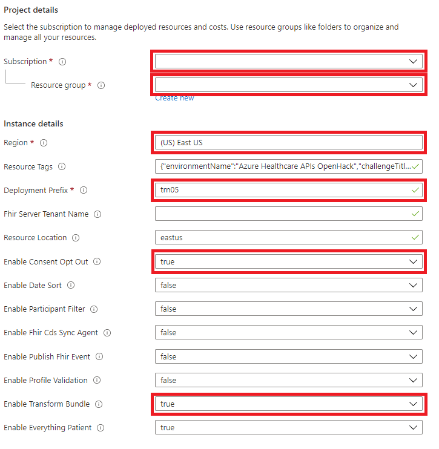 

__Note:__ Deployment of **FHIR service**, **FHIR-Proxy**, and **FHIR-Bulk Loader** typically takes 20 minutes.

### Deployed Components
When the deployment finishes, you should see these components in your resource group. 

Name              | Type                 |  Purpose                               
------------------|----------------------|----------------------------------------
[prefix]**hdsws**  | PaaS | **AHDS Workspace** - managed FHIR service
[prefix]**hdsws/fhirtrn**  | PaaS | **FHIR service** - managed FHIR service
[prefix]**pxyfa** | Function App | **FHIR-Proxy** - filters FHIR data input/output 
[prefix]**ldrfa** | Function App | **FHIR-Bulk Loader** - bulk ingest FHIR data
[prefix]**synfa** | Function App | **FHIR Synapse Link** - export FHIR data to ADLS Gen2 every 5 minutes
[prefix]**asp**   | App Service Plan | Shared by FHIR-Proxy and FHIR-Bulk Loader function apps
[prefix]**cr**    | Container Registry   | Supports FHIR service `$convert-data` operation
[prefix]**expsa** | Storage account      | Blob storage for FHIR service `$export` operation and FHIR-Bulk Loader
[prefix]**funsa** | Storage account      | Storage for FHIR-Proxy and Synapse Link Loader function apps
[prefix]**impsa** | Storage account      | Storage account for FHIR-Bulk Loader
[prefix]**kv**    | Key Vault            | Stores secrets and configuration settings
[prefix]**la**    | Log Analytics Workspace  | Logs the activity of deployed components
[prefix]**ldrai** | Application Insights | Monitors FHIR-Bulk Loader
[prefix]**pxyai** | Application Insights | Monitors FHIR-Proxy application
[prefix]**synai** | Application Insights | Monitors FHIR Synapse Link application
[prefix]**ldrtopic** | Event Grid System Topic | Triggers processing of FHIR bundles placed in the fssa storage account
[prefix]**rc**    | Redis Cache  | Required by FHIR-Proxy modules, Consent Opt Out

### Data Flow

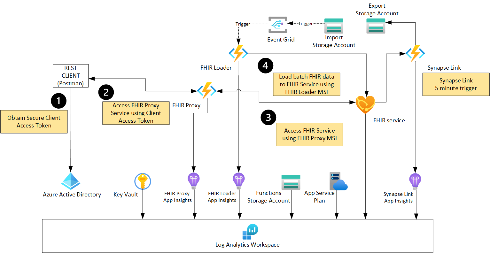

__Note:__ [Postman](https://www.getpostman.com/) is shown as an example REST client. If you are interested in setting up Postman to connect with FHIR service, please see [here](https://github.com/microsoft/health-architectures/tree/main/Postman) after completing steps 2 and 3 below. 

## Step 2 - Complete FHIR-Proxy Authentication 
Once initial deployment is finished, additional steps are necessary to complete the authentication configuration of the FHIR-Proxy function app. 

1. In the Azure Portal, navigate to the FHIR-Proxy function app that was deployed by the resource manager template. 
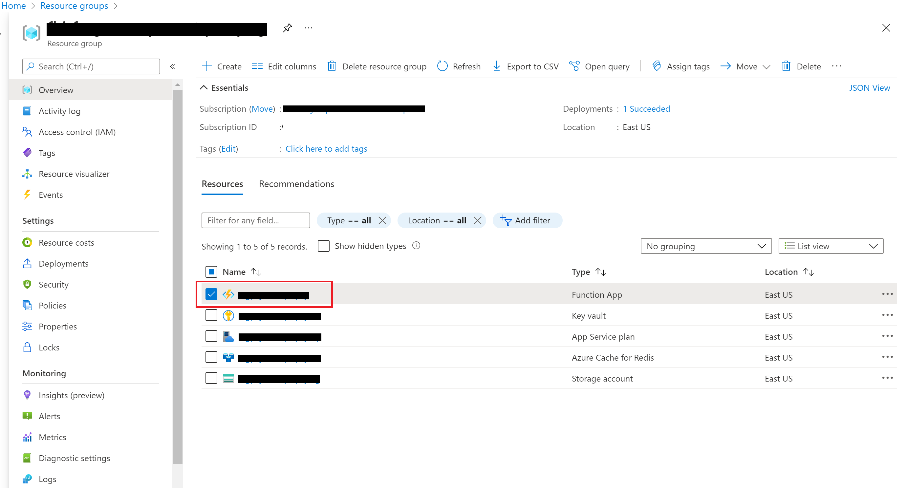

2. Select the function app and select **Authentication**.
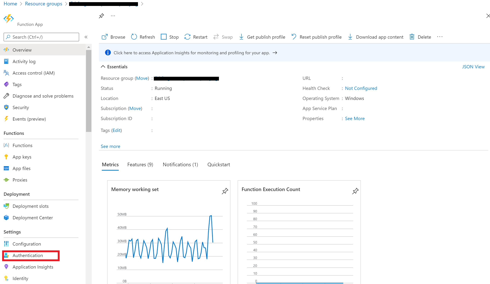

3. Click **Add identity provider**.
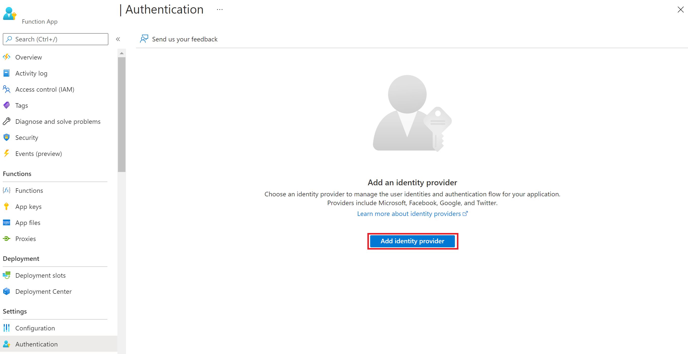

4. Select **Microsoft**.
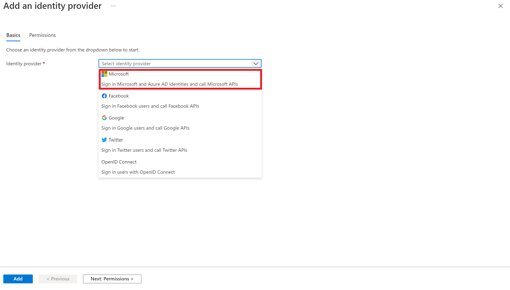

5. Configure basic settings as follows. The **Allow unauthenticated access** button should remain checked as this will make the FHIR service Capability Statement generally available. Click **Next Permissions**. 
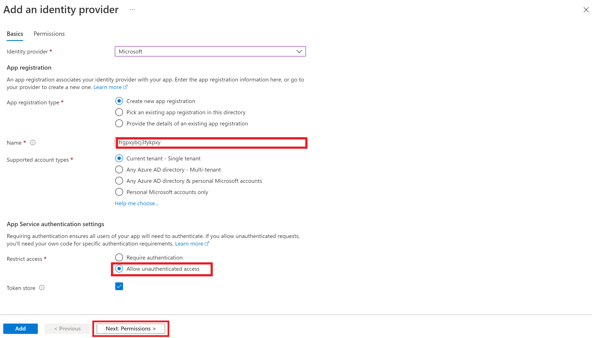

6. Click **Add**.
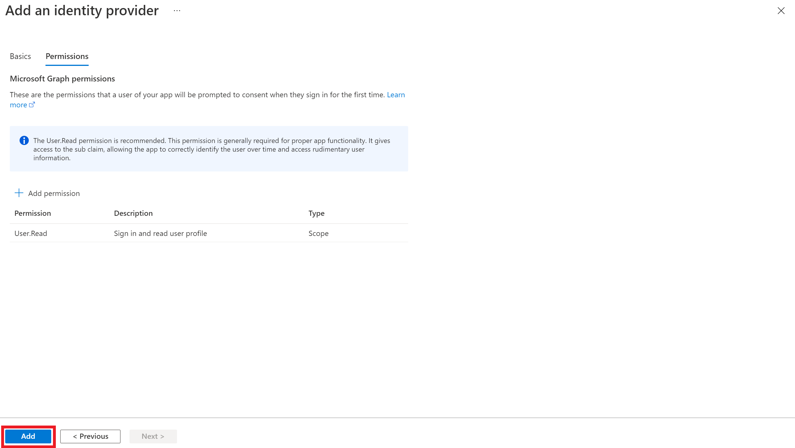

At this point, the FHIR-Proxy application registration is complete. 

## Step 3 - Configure App Roles and API Permissions 

Further configuration is required to define **App Roles and Permissions**. 

1. Click on the link next to the Microsoft identity provider, which will open the Azure AD blade.
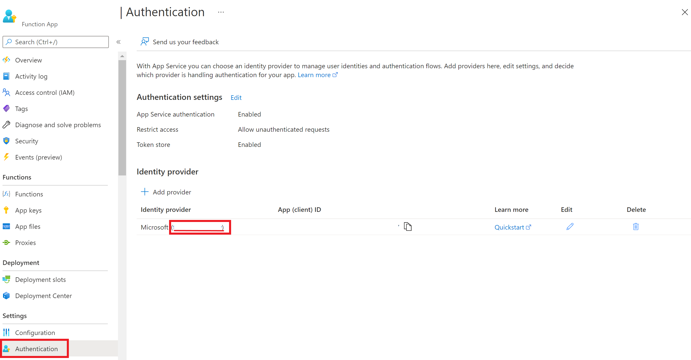

2. Click on **Manifest**.
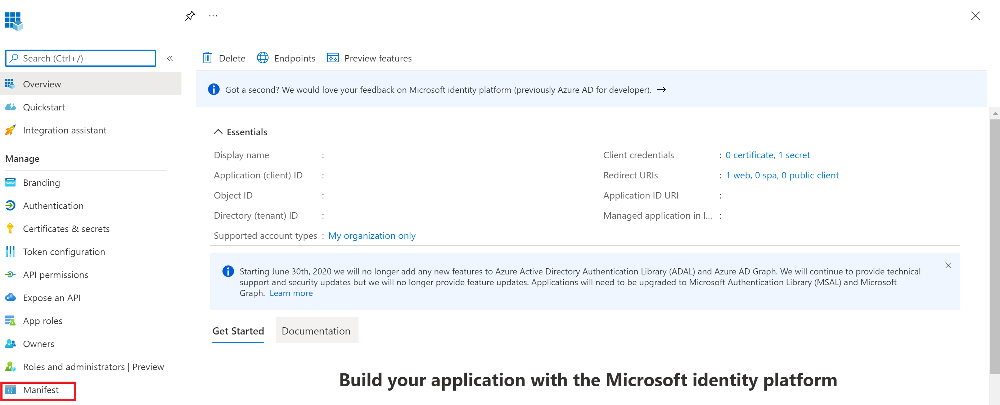

3. Update the **appRoles** element using the data in the [app roles json](./fhirproxyroles.json) file.
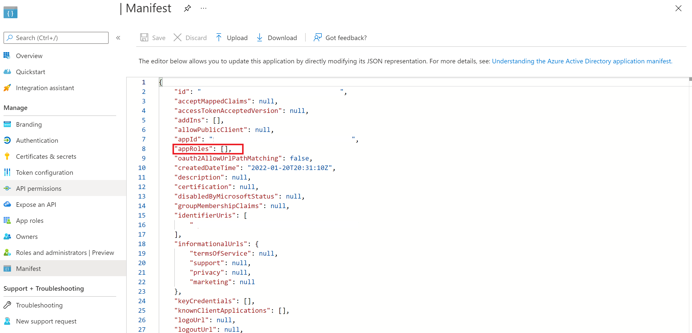

4. The **appRoles** element should look something like shown below. Click **Save**.
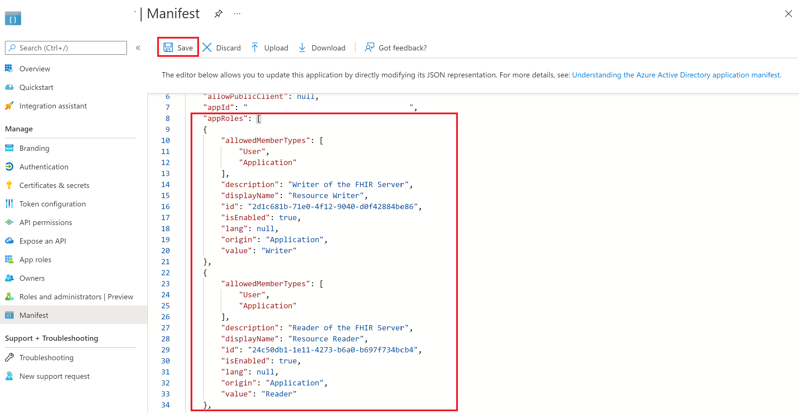

5. Select **API permissions** and **Add a Permission**.
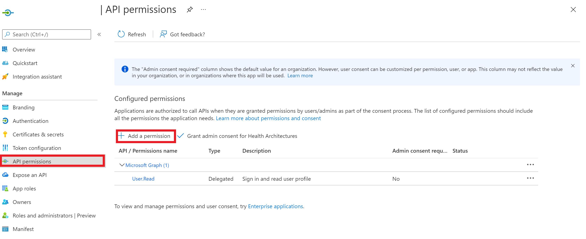

6. Select **APIs my organization uses**.
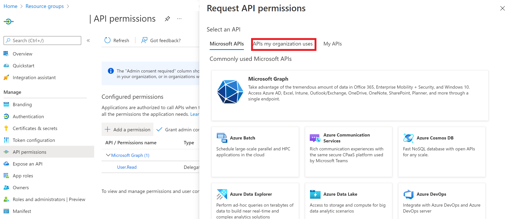

7. Filter the results to "Azure Healthcare APIs". Click on **Azure Healthcare APIs**.
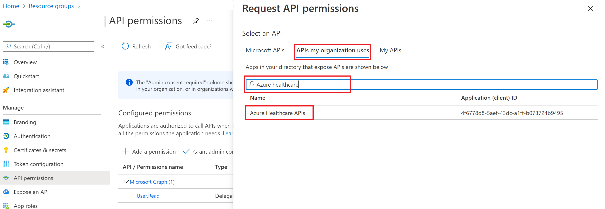

8. Select the **user_impersonation permission** box and click **Add permissions**.
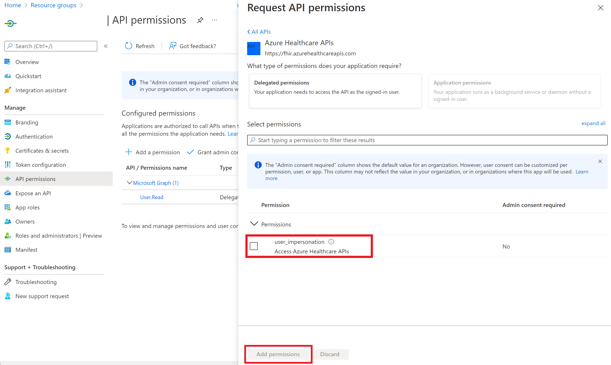

9. Verify the **API permissions**.
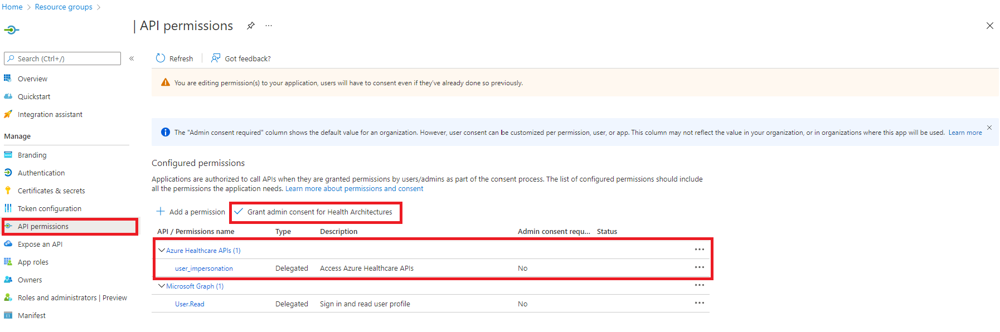

10. Verify that the **App roles** were created properly.

