# Postman setup for FHIR-Proxy

## Overview 
For testing the FHIR service in Azure Health Data Services, Postman is often configured to call the FHIR service's endpoint directly. In some circumstances, however, users may choose to deploy Microsoft's OSS [FHIR-Proxy](https://github.com/microsoft/fhir-proxy) to supplement the FHIR service with additional FHIR data filtering capabilities. When FHIR service is paired with FHIR-Proxy, testing the FHIR service with Postman requires Postman to be set up to call the FHIR-Proxy endpoint rather than the FHIR service endpoint directly. In this guide, we will take you through the steps needed to configure Postman to call a FHIR-Proxy endpoint.

## Prerequisites
+ [Contributor](https://docs.microsoft.com/en-us/azure/role-based-access-control/built-in-roles) role in your Azure Subscription 
+ [Application Administrator](https://docs.microsoft.com/en-us/azure/active-directory/roles/permissions-reference#all-roles) role in your Azure Active Directory (AAD) tenant 
+ **FHIR service** deployed. More information about FHIR service can be found [here](https://docs.microsoft.com/en-us/azure/healthcare-apis/fhir/overview). 
+ **FHIR-Proxy** deployed and set up with AAD authentication and app roles for connecting to FHIR service. See [here](FHIR-Starter_ARM_template_README.md#step-2---complete-fhir-proxy-authentication) for information about configuring FHIR-Proxy AAD authentication. 
+ **Postman** installed - desktop or web client. Postman should already be registered in AAD and set up with a `fhir-service` environment as detailed in [this guide](./Postman_FHIR_service_README.md). Information about installing Postman is available [here](https://www.getpostman.com/). 

## Getting started
To set up Postman for testing FHIR service via FHIR-Proxy, we'll walk through these steps:

**Step 1:** Configure API permissions for Postman to connect with FHIR-Proxy  
**Step 2:** Configure AAD roles for Postman  
**Step 3:** Import an environment template into Postman  
**Step 4:** Enter parameter values for the Postman environment  
**Step 5:** Get an authorization token from AAD  
**Step 6:** Test FHIR service with Postman connected to the FHIR-Proxy endpoint


## Step 1 - Configure API permissions for Postman
 
1. Navigate to the **Overview** blade for your Postman service client app in Azure Active Directory (go to **Azure Portal** -> **AAD** -> **App registrations** -> **Postman**).  
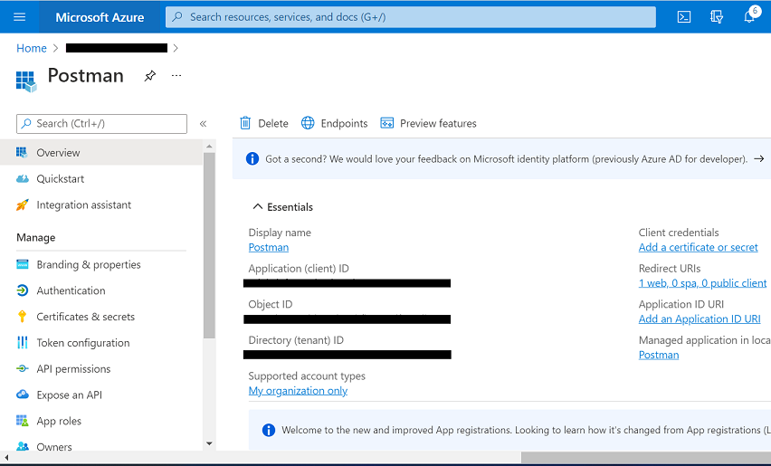  

2. Click on **API Permissions** and then click **+Add a permission**.  
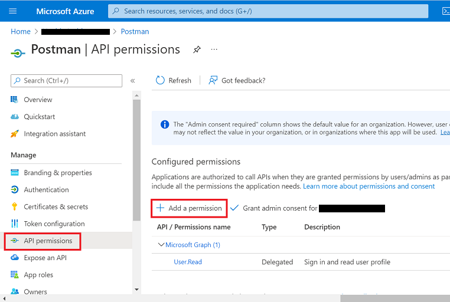

3. Select the **My APIs** tab and you will see a list containing the FHIR-Proxy instance that you deployed and registered earlier (see the Prerequisites section). Click on the FHIR-Proxy app name.
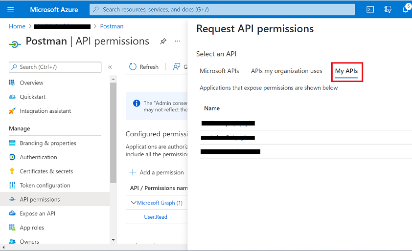

4. Under **Request API permissions**, click on **Delegated permissions**. 
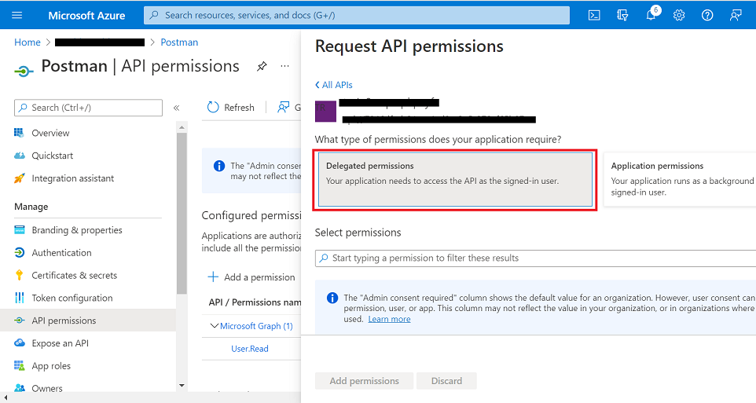

5. Scroll down and select **user_impersonation**. Then click **Add permissions**. 
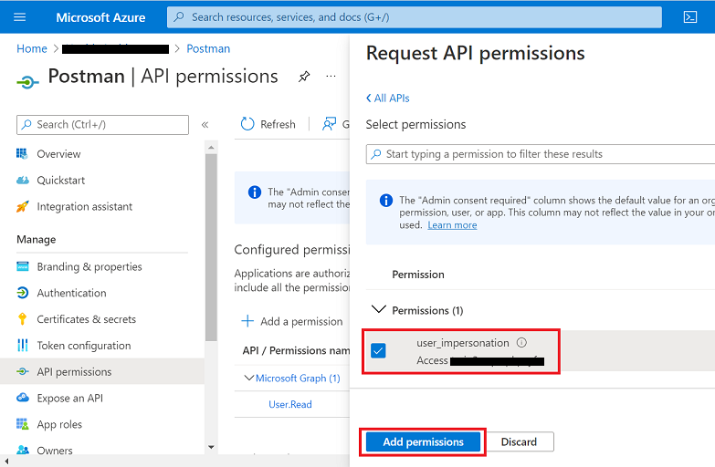

6. When back in the **API permissions** blade, make sure to click **Grant admin consent** (blue checkmark). 
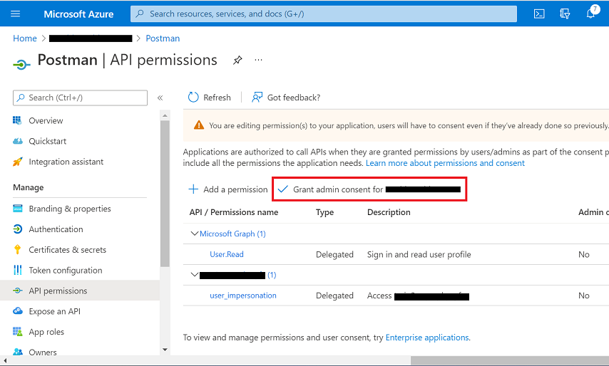  
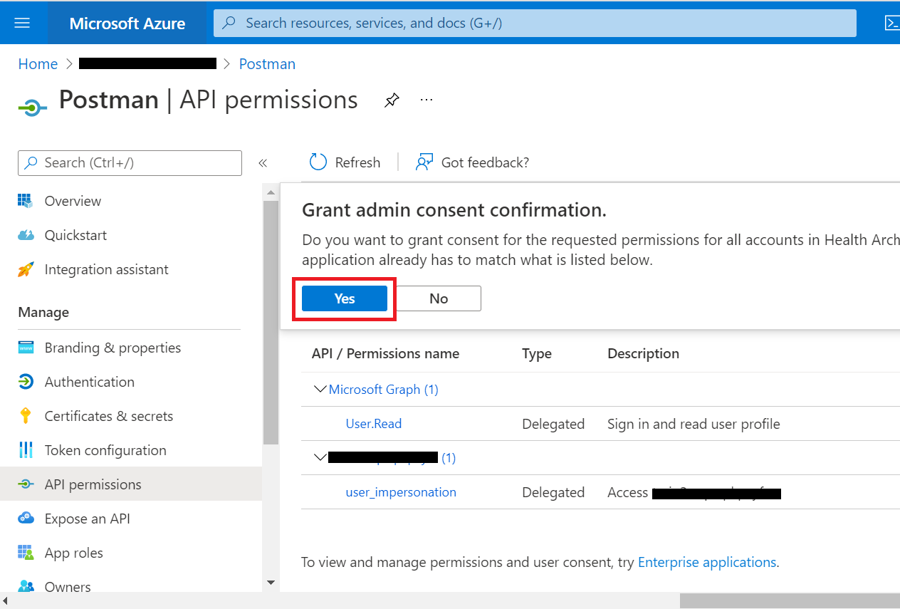  

7. Now, in the **API permissions** blade, click on **+Add a permission** (again). 

8. Select the **My APIs** tab (again). Click on the FHIR-Proxy app name.


9. Under **Request API permissions**, click on the **Application permissions** box on the right. 
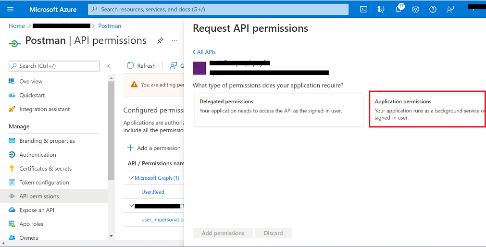

10. Select **Resource Reader** and **Resource Writer**. Click **Add permissions**. 
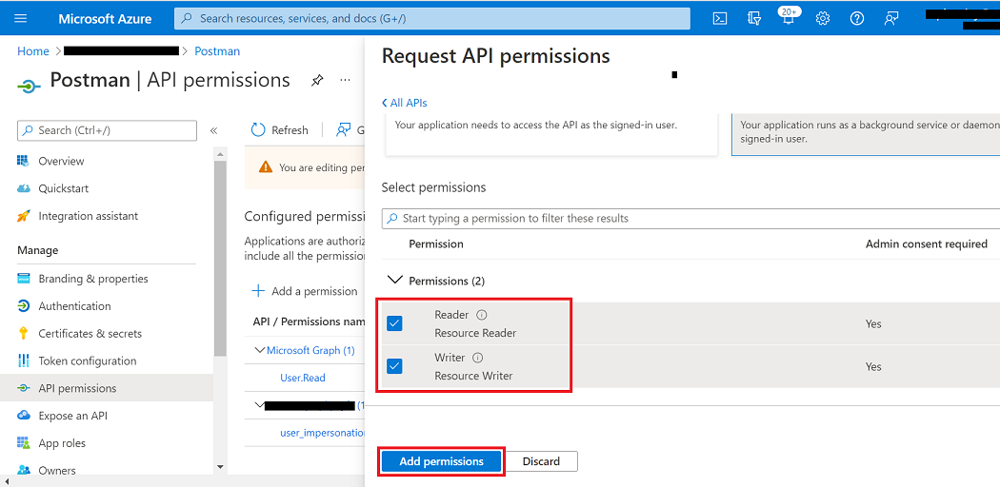

11. When back in the **API permissions** blade, make sure to click **Grant admin consent** again (blue checkmark).
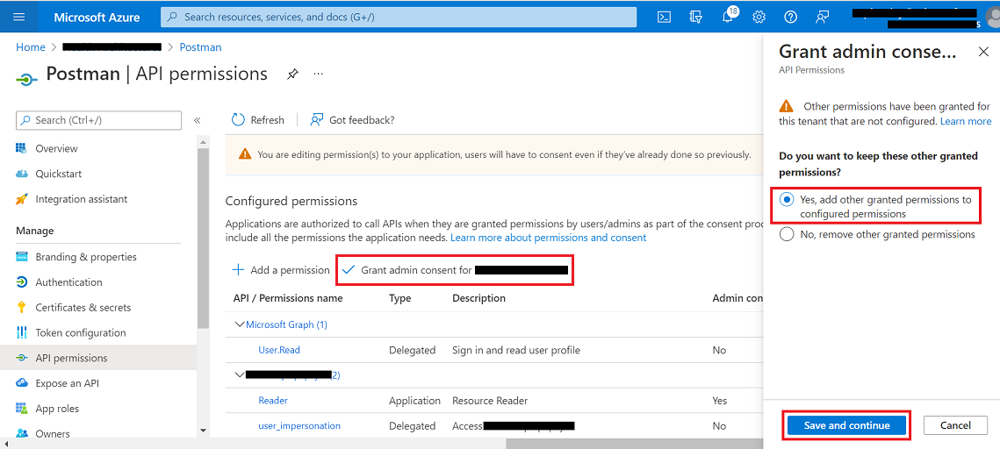

12. Now, in the **API permissions** blade, click **+Add a permission** (again). 

13. Under **Request API permissions**, select the **APIs my organization uses** tab. Type in "Azure Healthcare APIs" and select the item in the list. 
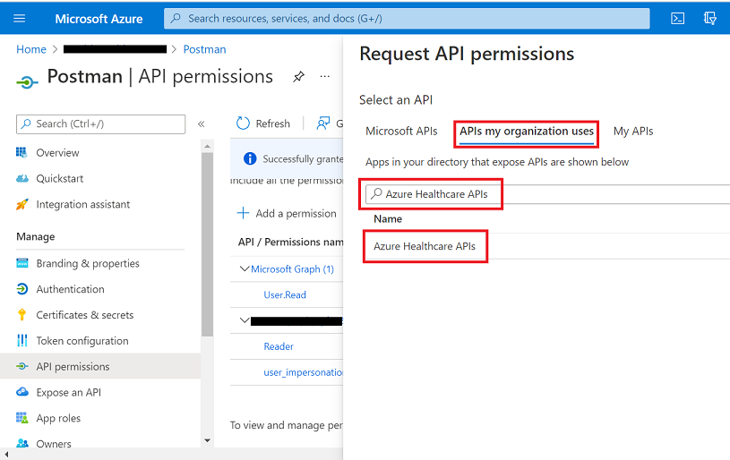

14. Scroll down and select **user_impersonation**. Then click **Add permissions**. 
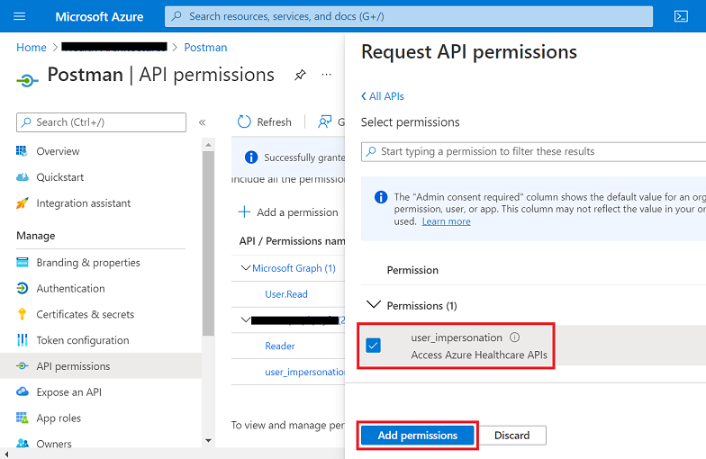

15. When back in the **API permissions** blade, make sure to click **Grant admin consent** again (blue checkmark). 


## Step 2 - Configure AAD roles for Postman

1. Now go to **Azure Active Directory** -> **Enterprise applications**. Search for your FHIR-Proxy function app name and click on it in the list. It might be easiest to search by the **Created on** date. 


2. You will be taken to the FHIR-Proxy **Overview** blade in Enterprise Applications. Click on **Users and groups**. 
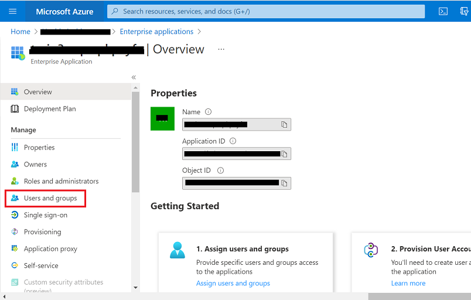

3. Click on **+Add user/group**. 
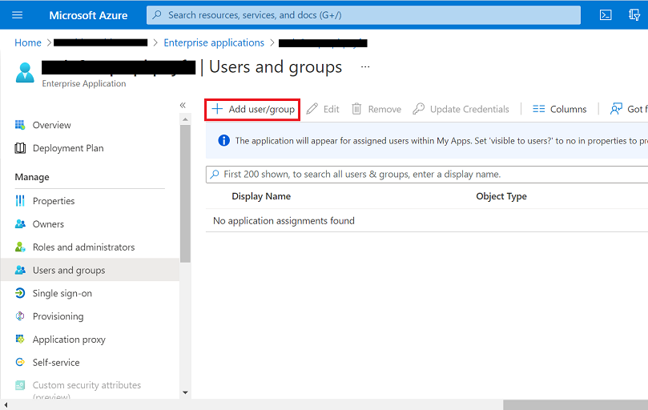

4. In **Add Assignment**, on the left under **Users**, click **None Selected**. Then under **Users** on the right side, type in your name or username in the search field. Click on your name, and then click **Select**. 
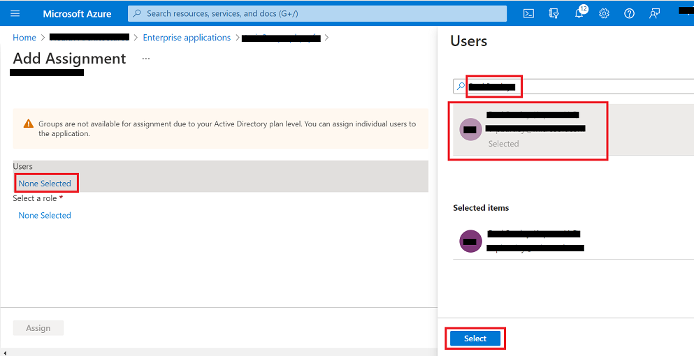

5. In **Add Assignment**, under **Select a role**, click **None Selected**. On the right side, click on **Resource Writer** and then click **Select**. 
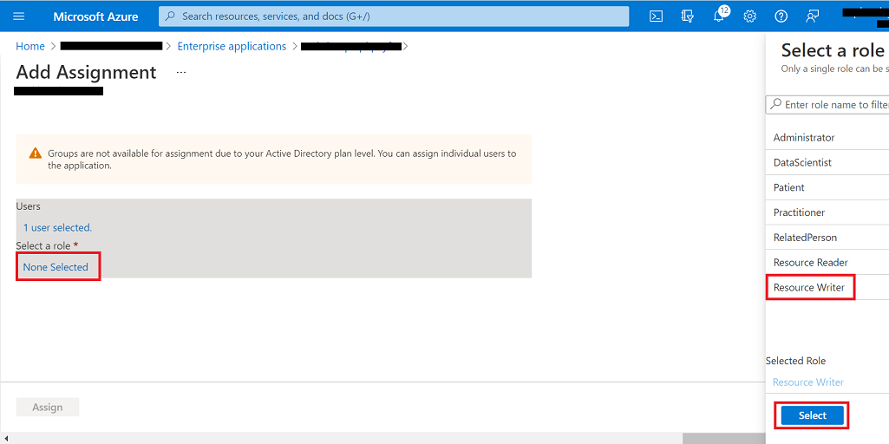

6. Back in **Add Assignment**, click **Assign**. 
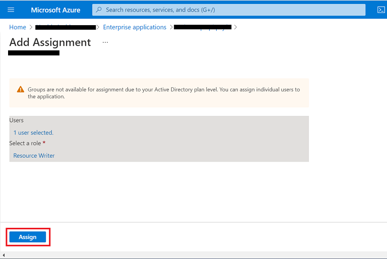


## Step 3 - Import the FHIR-Proxy environment template into Postman

1. Access the Postman environment template for FHIR-Proxy [here](./samples/fhir-proxy.postman_environment.json). Save the file locally (click on `Raw` and then do a **Save as** from your browser).

2. Import the ```fhir-proxy.postman_environment.json``` file that you just saved locally.
    + Add the file to Postman using the ```Upload Files``` button. Then click `Import`. 
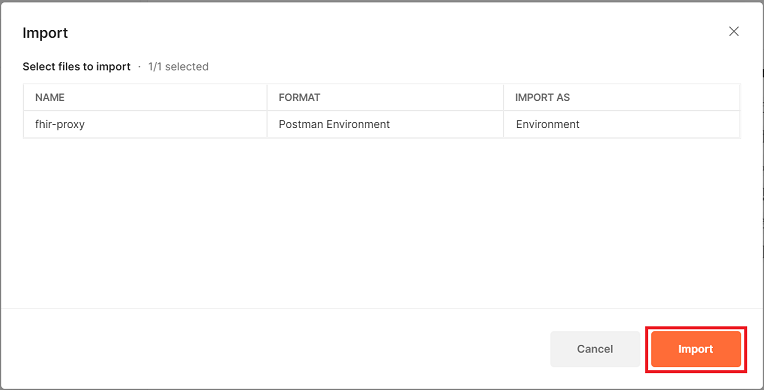

## Step 4 - Configure Postman FHIR-Proxy environment
Now you will configure your Postman environment for FHIR-Proxy (`fhir-proxy`).

1. For the `fhir-proxy` Postman environment, you will need to retrieve the following values: 

- `tenantId` - AAD tenant ID (go to **AAD** -> **Overview** -> **Tenant ID**) 
- `clientId` - Application (client) ID for Postman client app (go to **AAD** -> **App registrations** -> **Name** -> **Overview** -> **Application (client) ID**) 


- `clientSecret` - Client secret stored in your existing `fhir-service` Postman environment (obtained previously when you [set up Postman to connect with FHIR service](Postman_FHIR_service_README.md#step-4---configure-postman-environments)) 
- `resource` - Application (client) ID in the AAD client app for FHIR-Proxy (go to **AAD** -> **App registrations** -> **Name** -> **Overview** -> **Application (client) ID**) (same as `clientId` above) 
- `fhirurl` - FHIR-Proxy endpoint appended with `/fhir` - e.g. `https://<fhir_proxy_app_name>.azurewebsites.net/fhir` (go to **Resource Group** -> **Overview** -> **Name** -> **URL**; make sure to append `/fhir` on the end when inputting into the Postman environment)

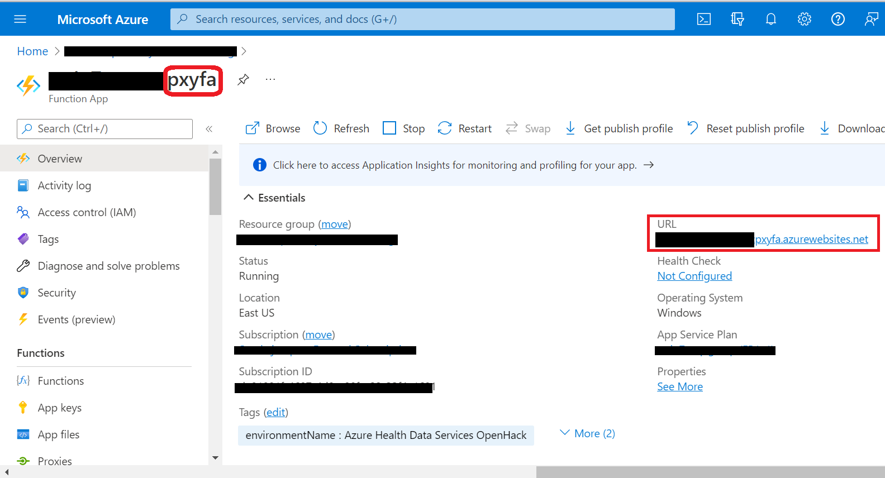


Populate the above parameter values in your `fhir-proxy` Postman environment as shown below. Leave `bearerToken` blank. **Be sure to click** `Save` **to retain the** `fhir-proxy` **environment values**.  

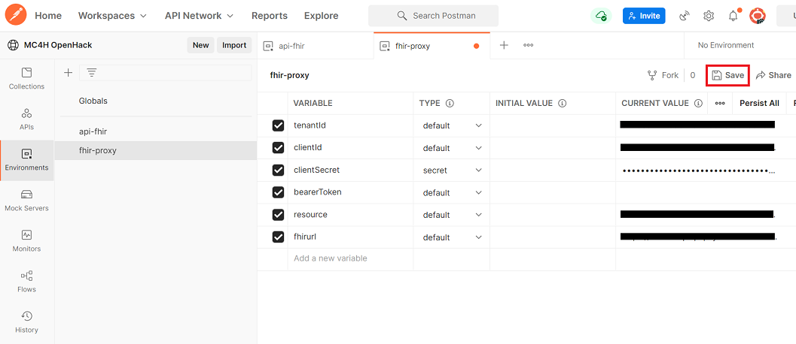 

## Step 5 - Get an access token from AAD
In order to connect to FHIR service, you will need to get an access token first. To obtain an access token from AAD via Postman, you can send a ```POST AuthorizeGetToken``` request. The ```POST AuthorizeGetToken``` call comes pre-configured as part of the `FHIR CALLS` collection that you imported earlier. 

In Postman, click on `Collections` on the left, select the `FHIR CALLS` collection, and then select `POST AuthorizeGetToken`. Press `Send` on the right.

__IMPORTANT:__ Be sure to make the `fhir-proxy` environment active by selecting from the dropdown menu above the `Send` button. In the image below, `fhir-proxy` is shown as the active environment.


On clicking ```Send```, you should receive a response in the **Body** tab like shown below. The `access_token` value is automatically saved to the ```bearerToken``` variable in the Postman environment. 

```
{
    "token_type": "Bearer",
    "expires_in": "3599",
    "ext_expires_in": "3599",
    "expires_on": "XXXXXXXXXX",
    "not_before": "XXXXXXXXXX",
    "resource": "XXXXXXX-XXXX-XXXX-XXXX-XXXXXXXXXXXX",
    "access_token": "XXXXXXXXXXXX..."
}
```

You now have a valid access token in your Postman environment and can use the token in subsequent API calls to FHIR service - passing through FHIR-Proxy on the way in. For more information about access tokens in AAD, see [Microsoft identity platform access tokens](https://docs.microsoft.com/en-us/azure/active-directory/develop/access-tokens).

__Note:__ Access tokens expire after 60 minutes. To obtain a token refresh, simply make another ```POST AuthorizeGetToken``` call and you will receive a new token valid for another 60 minutes.

## Step 6 - Test FHIR service with Postman 

1. In Postman, click on `Collections` on the left, select the `FHIR CALLS` collection, and then select the `GET List Metadata` call. Your Postman interface should look something like this: 

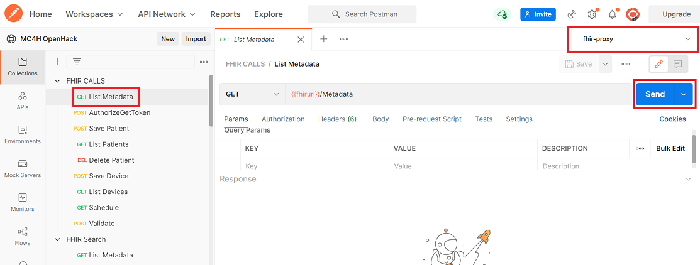

2. Click `Send` to test that FHIR service and FHIR-Proxy are functioning on a basic level. The `GET List Metadata` call returns the FHIR service's [Capability Statement](https://www.hl7.org/fhir/capabilitystatement.html). If you receive an error, there should be information in the response indicating the cause of the error. If you receive a response like shown below, this means your setup has passed the first test. 

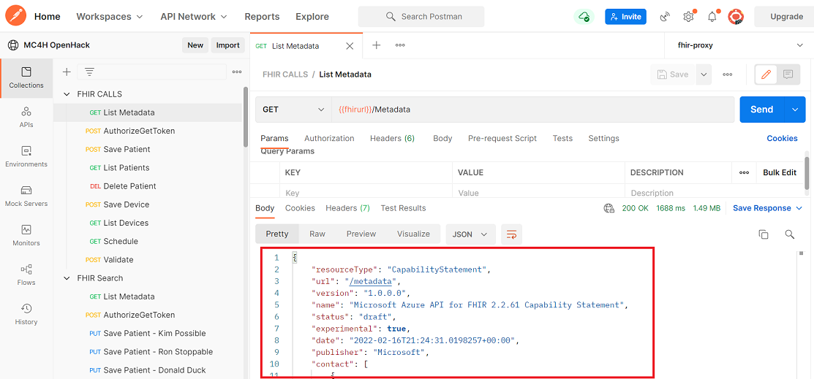

3. Click on `POST Save Patient` in the `FHIR CALLS` collection and press `Send`. If you get a response like shown below, this means you succeeded in populating FHIR service with a Patient Resource. This indicates that your setup is functioning properly. 

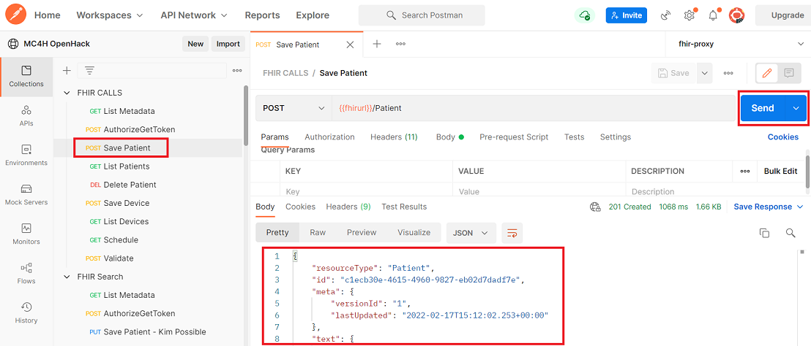

4. Try `GET List Patients` in the `FHIR CALLS` collection and press `Send`. If the response is as shown below, this means you successfully queried FHIR service for a list of every Patient Resource stored in the FHIR service's database. This means your setup with FHIR-Proxy connected to FHIR service is fully functional.

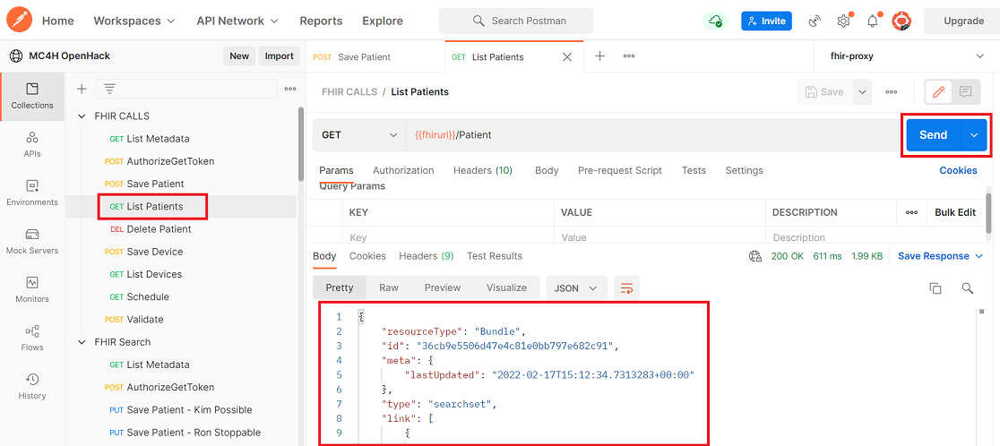

5. Now you can experiment with other sample calls or your own FHIR API calls.

