# Postman setup for FHIR service + sample Postman collections 

## Overview 
When testing data connectivity between [FHIR service](https://docs.microsoft.com/en-us/azure/healthcare-apis/fhir/overview) and a remote client app, it is useful to have an API testing utility to send requests, view responses, and debug issues. One of the most popular API testing tools is [Postman](https://www.postman.com/), and in this guide we provide instructions plus a set of sample data files to help you get started with Postman as a testing platform for FHIR service in [Azure Health Data Services](https://docs.microsoft.com/en-us/azure/healthcare-apis/healthcare-apis-overview).

## Prerequisites
+ [User Access Administrator](https://docs.microsoft.com/en-us/azure/role-based-access-control/built-in-roles#user-access-administrator) role in your FHIR service resource group or Azure subscription
+ [Application Administrator](https://docs.microsoft.com/en-us/azure/active-directory/roles/permissions-reference#all-roles) role in your Azure Active Directory (AAD) tenant
+ **FHIR service** deployed. Information about FHIR service can be found [here](https://docs.microsoft.com/en-us/azure/healthcare-apis/fhir/overview).
+ **Postman** installed - desktop or web client. Information about installing Postman is available [here](https://www.getpostman.com/). 

## Getting started
To set up Postman for testing FHIR service, we'll walk through these steps:

**Step 1:** Create an App Registration for Postman in AAD  
**Step 2:** Assign FHIR Data Contributor role in Azure for Postman  
**Step 3:** Import environment template and collection files into Postman  
**Step 4:** Enter parameter values for the Postman environment  
**Step 5:** Get an authorization token from AAD  
**Step 6:** Test FHIR service with Postman  

## Step 1 - Create an App Registration for Postman in AAD 

Before you can use Postman to make API calls to FHIR service, you will need to create a registered [client application](https://docs.microsoft.com/en-us/azure/healthcare-apis/register-application) to represent Postman in Azure Active Directory.

1. In Azure Portal, go to **Azure Active Directory** -> **App registrations** and click **New registration**. 
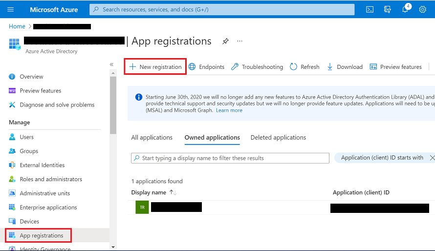

2. Type in a name for your Postman client app in the **Name** field and click **Register** below. 
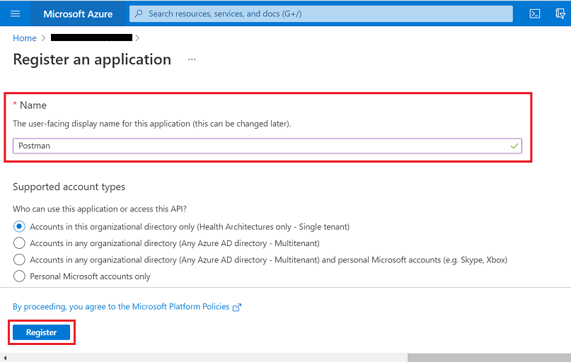

3. Now you will be taken to the **Overview** blade for your Postman client app in AAD.  
  

4. Click on **Certificates and secrets**. Click **+New client secret**. 
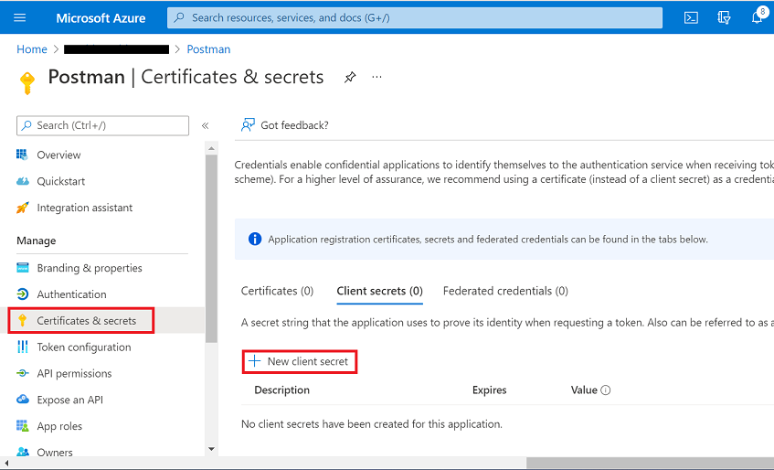

5. Under **Add a client secret**, enter a name for the secret in the **Description** field. Click **Add**. 
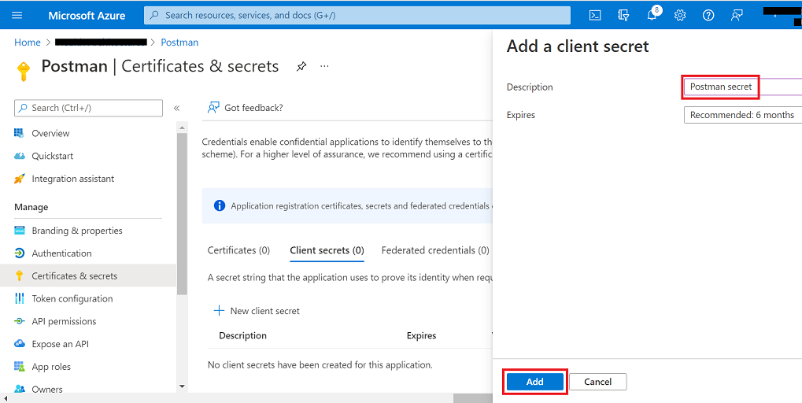

6. Copy the secret **Value** and securely store it somewhere (you will need this when you configure your Postman environment). 
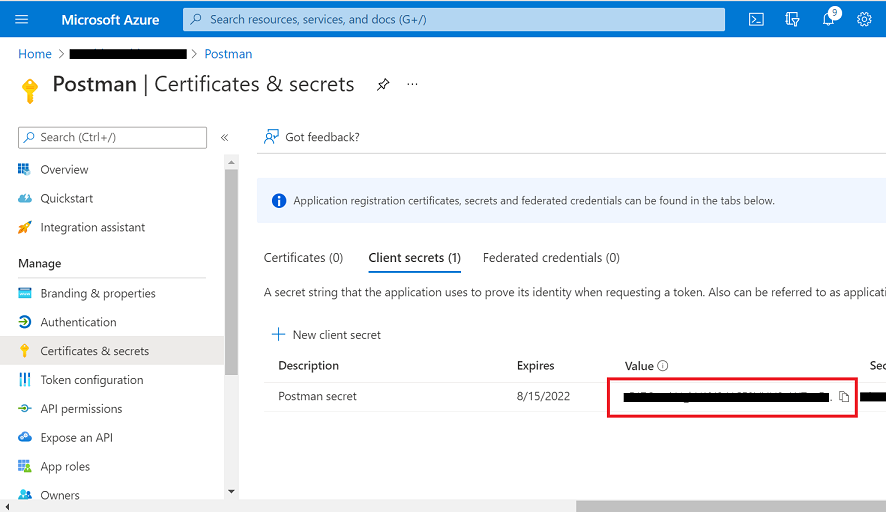

For more information on registering client applications in AAD for Azure Health Data Services, please see the [Authentication and Authorization for Azure Health Data Services](https://docs.microsoft.com/azure/healthcare-apis/authentication-authorization) documentation. 

## Step 2 - Assign FHIR Data Contributor role in Azure for Postman

1. In Azure Portal, go to the resource group containing your FHIR service instance. When in the resource group **Overview**, click on your FHIR service name in the list. 
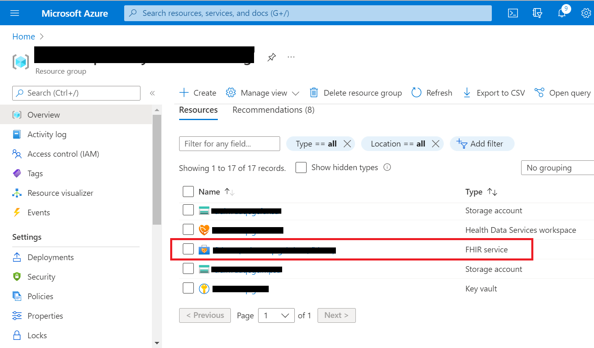

2. Go to the **Access Control (IAM)** blade. Click on **+Add** -> **Add role assignment**. 
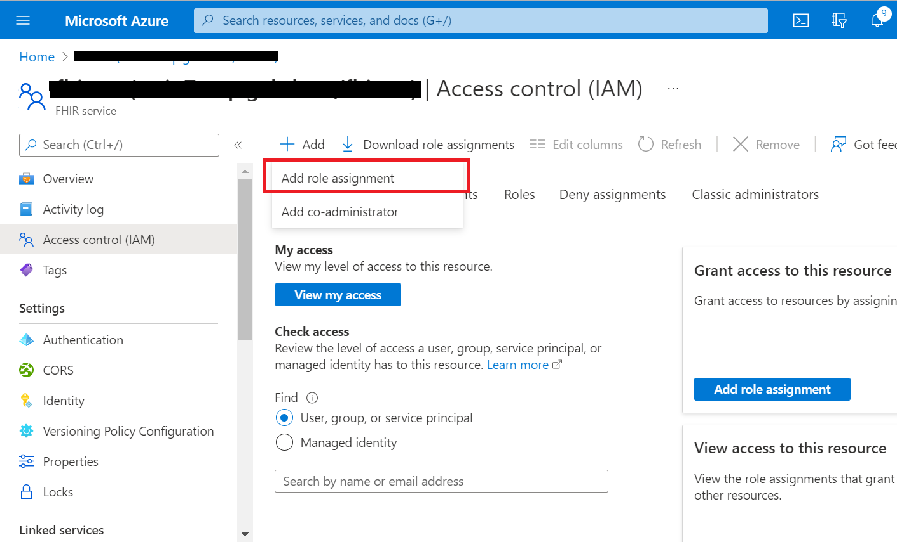

3. In **Add role assignment** under the **Role** tab, scroll down in the list and select **FHIR Data Contributor**. Then click **Next**. 
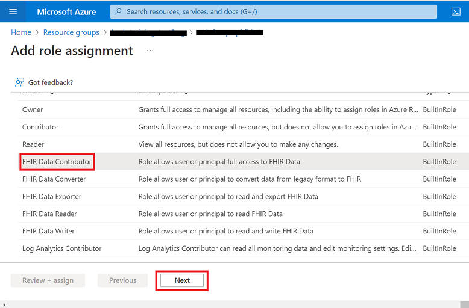

4. Under the **Members** tab, click on **+Select members**. Type in the name of your Postman client app in the **Select** field on the right. Highlight the name and click **Select**. Then click **Next**. 
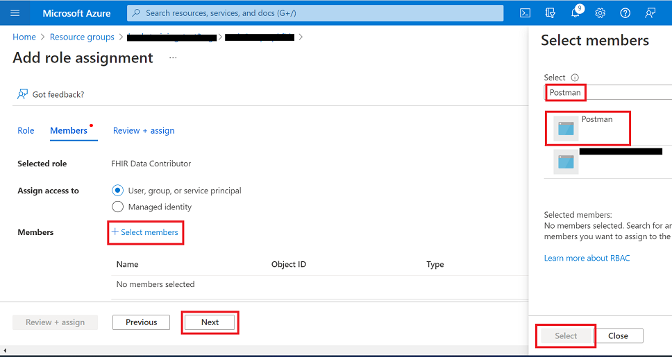

5. Under the **Review + assign** tab, click **Review + assign**. 
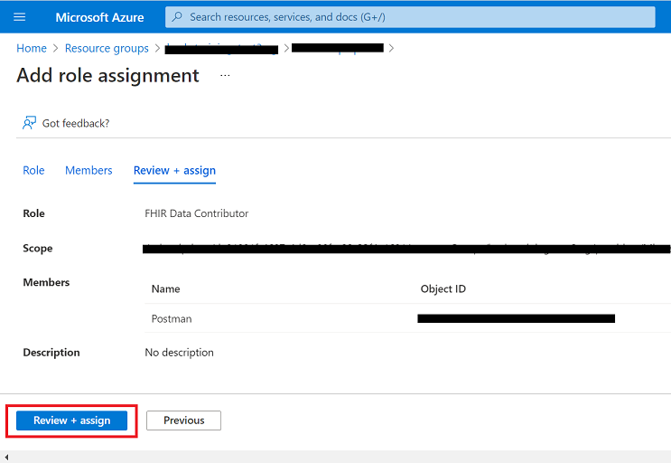

6. When back in the **Access Control (IAM)** blade, click **+Add** -> **Add role assignment** (again). 


7. In **Add role assignment** under the **Role** tab, select **FHIR Data Contributor** (again) and click **Next**. 


8. Under the **Members** tab, click on **+Select members**. Type in your name or username in the **Select** field on the right. Highlight your name, click **Select**, and then click **Next**. 
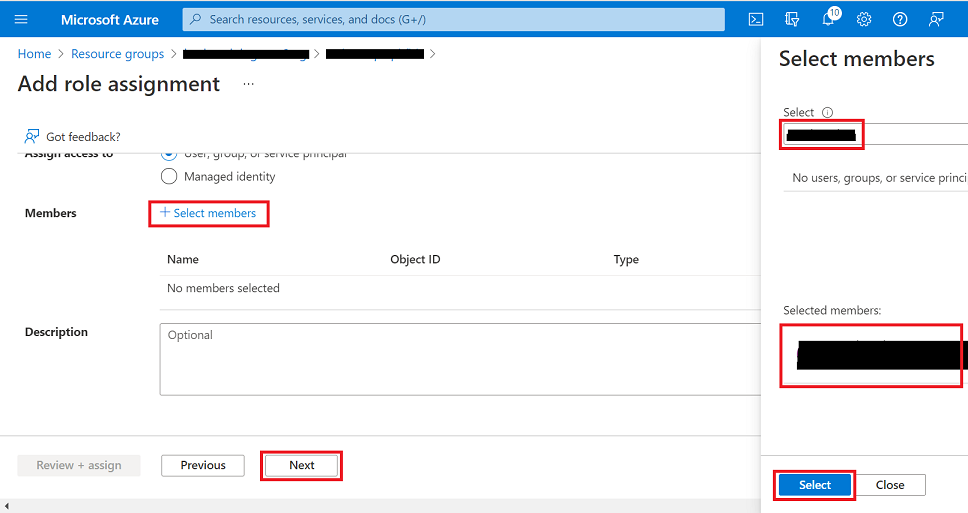

9. Under the **Review + assign** tab, click **Review + assign**. 
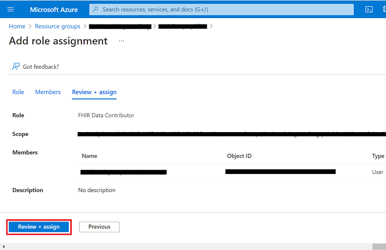

For more information on assigning user/app roles, see [Configure Azure RBAC for Azure Health Data Services](https://docs.microsoft.com/azure/healthcare-apis/configure-azure-rbac).

## Step 3 - Import environment and collection files into Postman

1. Access the Postman environment template for FHIR service [here](./samples/fhir-service.postman_environment.json). Save the file locally (click on `Raw` and then do a **Save as** from your browser). 

2. In Postman, create a new Workspace (or select an existing one if already created).

3. Go to `Environments` on the left and click the ```Import``` button next to the workspace name. 
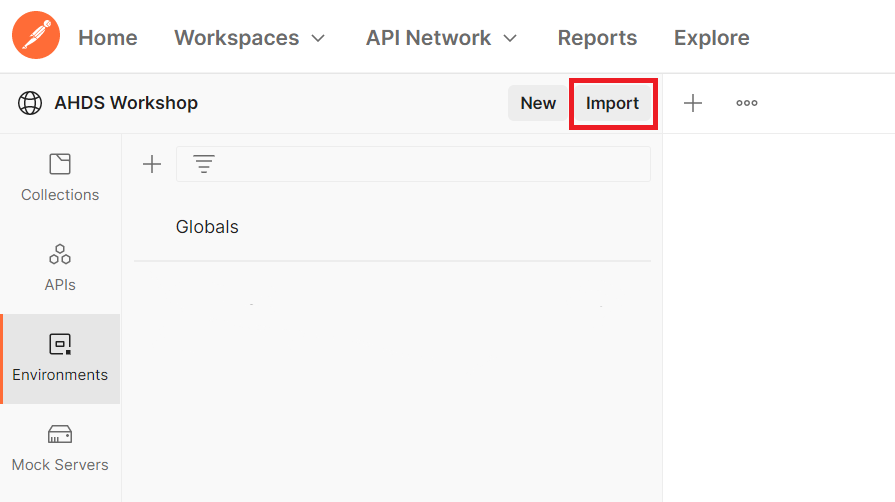

4. Import the ```fhir-service.postman_environment.json``` file that you just saved locally.
    + Add the file to Postman using the ```Upload Files``` button. Then click `Import`. 
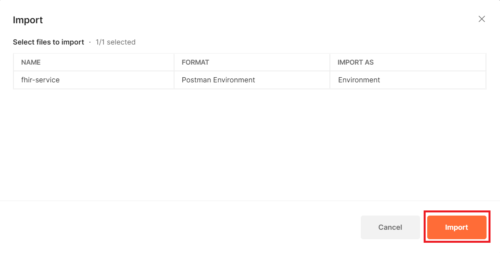

5. Now, access the ```FHIR-CALLS.postman-collection.json``` file available in this repo [here](./samples/FHIR-CALLS.postman_collection.json) and save the file locally. Then import the file into Postman.
    + Add the file to Postman using the ```Upload Files``` button. Then click `Import`. 
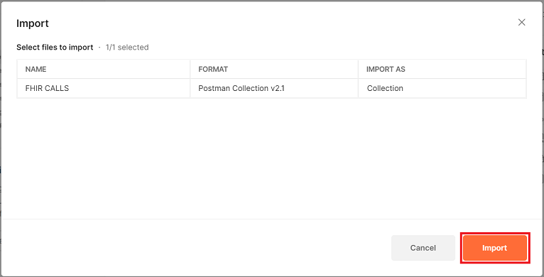

6. Access the ```FHIR_Search.postman_collection.json``` file available in this repo [here](./samples/FHIR_Search.postman_collection.json) and save the file locally. Then import the file into Postman.
    + Add the file to Postman using the ```Upload Files``` button. Then click `Import`. 
 


## Step 4 - Configure Postman environments
Now you will configure your Postman environment (`fhir-service`). 

1. For the `fhir-service` Postman environment, you will need to retrieve the following values: 

- `tenantId` - AAD tenant ID (go to **AAD** -> **Overview** -> **Tenant ID**)
- `clientId` - Application (client) ID for Postman client app (go to **AAD** -> **App registrations** -> **Name** -> **Overview** -> **Application (client) ID**) 
- `clientSecret` - Client secret stored for Postman (see Step 1 #6 above) 
- `fhirurl` - FHIR service endpoint - e.g. `https://<workspace-name>-<fhir-service-name>.azurehealthcareapis.com` (go to **Resource Group** -> **Overview** -> **Name** -> **FHIR metadata endpoint** and copy *without* "/metadata" on the end)
- `resource` - FHIR service endpoint - e.g. `https://<workspace-name>-<fhir-service-name>.azurehealthcareapis.com` (same as `fhirurl`)

Populate the above parameter values in your `fhir-service` Postman environment as shown below. Leave `bearerToken` blank. Make sure to click `Save` to retain the `fhir-service` environment values.  

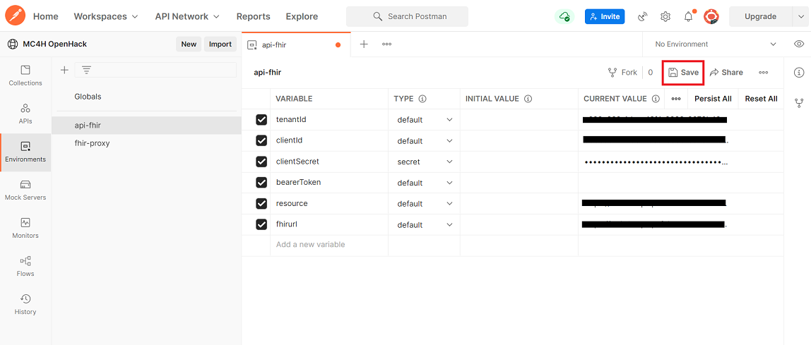

## Step 5 - Get an access token from AAD
In order to connect to FHIR service, you will need to get an access token first. To obtain an access token from AAD via Postman, you can send a ```POST AuthorizeGetToken``` request. The ```POST AuthorizeGetToken``` call comes pre-configured as part of the `FHIR CALLS` collection that you imported earlier. 

In Postman, click on `Collections` on the left, select the `FHIR CALLS` collection, and then select `POST AuthorizeGetToken`. Press `Send` on the right.

__Important:__ Be sure to make the `fhir-service` environment active by selecting from the dropdown menu above the `Send` button. In the image below, `fhir-service` is shown as the active environment.

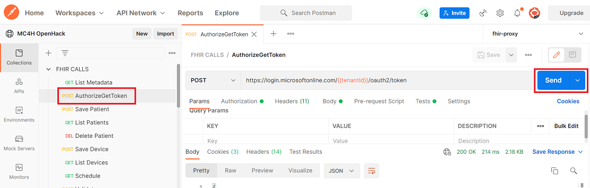

On clicking ```Send```, you should receive a response in the **Body** tab like shown below. The `access_token` value is automatically saved to the ```bearerToken``` variable in the Postman environment. 

```
{
    "token_type": "Bearer",
    "expires_in": "3599",
    "ext_expires_in": "3599",
    "expires_on": "XXXXXXXXXX",
    "not_before": "XXXXXXXXXX",
    "resource": "XXXXXXX-XXXX-XXXX-XXXX-XXXXXXXXXXXX",
    "access_token": "XXXXXXXXXXXX..."
}
```

You now have a valid access token in your Postman environment and can use the token in subsequent API calls to FHIR service. For more information about access tokens in AAD, see [Microsoft identity platform access tokens](https://docs.microsoft.com/en-us/azure/active-directory/develop/access-tokens).

__Note:__ Access tokens expire after 60 minutes. To obtain a token refresh, simply make another ```POST AuthorizeGetToken``` call and you will receive a new token valid for another 60 minutes.

## Step 6 - Test FHIR service with Postman 

1. In Postman, click on `Collections` on the left, select the `FHIR CALLS` collection, and then select the `GET List Metadata` call. Your Postman interface should look something like this: 

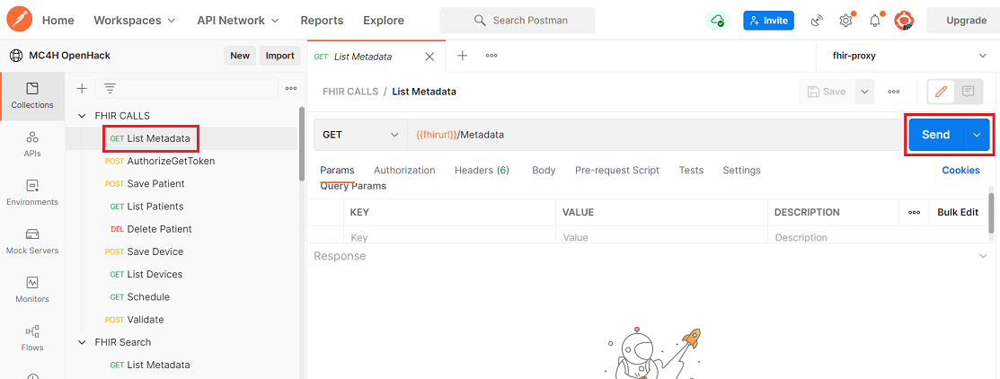

2. Click `Send` to test that FHIR service is functioning on a basic level. The `GET List Metadata` call returns the FHIR service's [Capability Statement](https://www.hl7.org/fhir/capabilitystatement.html). If you receive an error, there should be information in the response indicating the cause of the error. If you receive a response like shown below, this means your setup has passed the first test. 


3. Click on `POST Save Patient` in the `FHIR CALLS` collection and press `Send`. If you get a response like shown below, this means you succeeded in populating FHIR service with a Patient Resource. This indicates that your setup is functioning properly. 


4. Try `GET List Patients` in the `FHIR CALLS` collection and press `Send`. If the response is as shown below, this means you successfully queried FHIR service for a list of every Patient Resource stored on the FHIR server. This means your setup is fully functional.


5. Now you can experiment with other sample calls or your own FHIR API calls.

### Resources 

A tutorial for using Postman with FHIR service is available on [docs.microsoft.com](https://docs.microsoft.com/azure/healthcare-apis/fhir/use-postman).
 
### FAQ's / Issues 

- Error with ```POST AuthorizeGetToken```: Ensure you selected your environment in Postman and that you saved it.
- 403 - Unauthorized:  Check the Azure RBAC for FHIR service ([link](https://docs.microsoft.com/azure/healthcare-apis/configure-azure-rbac)).
